# Step-by-step scRNA-seq Pipeline

## Before you begin
- Load the R packages.
```{R, eval=FALSE}
library(Seurat)
library(phateR)
library(DoubletFinder)
library(monocle)
library(slingshot)
library(GSVA)
library(limma)
library(plyr)
library(dplyr)
library(org.Mm.eg.db)
library(org.Hs.eg.db)
library(CellChat)
library(velocyto.R)
library(SeuratWrappers)
library(stringr)
library(scran)
library(ggpubr)
library(viridis)
library(pheatmap)
library(parallel)
library(reticulate)
library(SCENIC)
library(feather)
library(AUCell)
library(RcisTarget)
library(Matrix)
library(foreach)
library(doParallel)
library(clusterProfiler)
<<<<<<< Updated upstream
library(OpenXGR)
=======
# st libraries
>>>>>>> Stashed changes
library(RColorBrewer)
library(Rfast2)
library(SeuratDisk)
library(abcCellmap)
library(biomaRt)
library(copykat)
library(gelnet)
library(ggplot2)
library(parallelDist)
library(patchwork)
library(markdown)
library(getopt)
library(tools)
library(HemaScopeR)
```

- Set the paths for the output results, and the Python installation.
```{R, eval=FALSE}
output.dir = './output'
pythonPath = '/home/anaconda3/envs/HemaScopeR/bin/python'
```

- Create folders for saving the results of HemaScopeR analysis.
```{R, eval=FALSE}
wdir <- getwd()

if(is.null(pythonPath)==FALSE){ reticulate::use_python(pythonPath) }else{print('Please set the path of Python.')}

if (!file.exists(paste0(output.dir, '/HemaScopeR_results'))) {
 dir.create(paste0(output.dir, '/HemaScopeR_results'),recursive =T)
}

output.dir <- paste0(output.dir,'/HemaScopeR_results')

if (!file.exists(paste0(output.dir, '/RDSfiles/'))) {
 dir.create(paste0(output.dir, '/RDSfiles/'))
}

#set the path for loading previous results, if necessary
previous_results_path <- paste0(output.dir, '/RDSfiles/')  
# if (Whether_load_previous_results) {
#    print('Loading the previous results...') 
#    Load_previous_results(previous_results_path = previous_results_path)
# }
```

## Step 1. Load the input data

- Create a folder for step1
```{R, eval=FALSE}
print('Step1. Input data.')
if (!file.exists(paste0(output.dir, '/Step1.Input_data/'))) {
  dir.create(paste0(output.dir, '/Step1.Input_data/'))
}  
```

- Set the parameters for loading the data sets.
```{R, eval=FALSE}
input.data.dirs = c('./SRR7881399/outs/filtered_feature_bc_matrix')#,
                    #'./SRR7881400/outs/filtered_feature_bc_matrix',
                    #'./SRR7881401/outs/filtered_feature_bc_matrix',
                    #'./SRR7881402/outs/filtered_feature_bc_matrix',
                    #'./SRR7881403/outs/filtered_feature_bc_matrix'

project.names = c('SRR7881399')#,
                  #'SRR7881400',
                  #'SRR7881401',
                  #'SRR7881402',
                  #'SRR7881403'
gene.column = 2
min.cells = 10
min.feature = 200
mt.pattern = '^MT-' # set '^mt-' for mouse data
Step1_Input_Data.type = 'cellranger-count'
loom.files.path ="./SRR7881399/loom"
```

- Load the data sets
```{R, eval=FALSE}
file.copy(from = input.data.dirs, to = paste0(output.dir,'/Step1.Input_data/'), recursive = TRUE)

if(Step1_Input_Data.type == 'cellranger-count'){
  if(length(input.data.dirs) > 1){
    input.data.list <- c()
    for (i in 1:length(input.data.dirs)) {
        
          sc_data.temp <- Read10X(data.dir = input.data.dirs[i],
                                  gene.column = gene.column)
          sc_object.temp <- CreateSeuratObject(counts = sc_data.temp,
                                               project = project.names[i],
                                               min.cells = min.cells,
                                               min.feature = min.feature)
          sc_object.temp[["percent.mt"]] <- PercentageFeatureSet(sc_object.temp, pattern = mt.pattern)
          input.data.list <- c(input.data.list, sc_object.temp)}
      
  }else{
      
          sc_data <- Read10X(data.dir = input.data.dirs,
                             gene.column = gene.column)
          sc_object <- CreateSeuratObject(counts = sc_data,
                                          project = project.names,
                                          min.cells = min.cells,
                                          min.feature = min.feature)
          sc_object[["percent.mt"]] <- PercentageFeatureSet(sc_object, pattern = mt.pattern) 
      
  }
}else if(Step1_Input_Data.type == 'Seurat'){
  if(length(input.data.dirs) > 1){
    input.data.list <- c()
    for (i in 1:length(input.data.dirs)) {
          sc_object.temp <- readRDS(input.data.dirs[i])
          sc_object.temp[["percent.mt"]] <- PercentageFeatureSet(sc_object.temp, pattern = mt.pattern)
          input.data.list <- c(input.data.list, sc_object.temp)
    }
  }else{
      sc_object <- readRDS(input.data.dirs)
      sc_object[["percent.mt"]] <- PercentageFeatureSet(sc_object, pattern = mt.pattern) 
  }
}else if(Step1_Input_Data.type == 'Matrix'){
    if(length(input.data.dirs) > 1){
    input.data.list <- c()
    for (i in 1:length(input.data.dirs)) {
          sc_data.temp <- readRDS(input.data.dirs[i])
          sc_object.temp <- CreateSeuratObject(counts = sc_data.temp,
                                               project = project.names[i],
                                               min.cells = min.cells,
                                               min.feature = min.feature)
          sc_object.temp[["percent.mt"]] <- PercentageFeatureSet(sc_object.temp, pattern = mt.pattern)
          input.data.list <- c(input.data.list, sc_object.temp)}
      
  }else{
      
          sc_data <- readRDS(input.data.dirs)
          sc_object <- CreateSeuratObject(counts = sc_data,
                                          project = project.names,
                                          min.cells = min.cells,
                                          min.feature = min.feature)
          sc_object[["percent.mt"]] <- PercentageFeatureSet(sc_object, pattern = mt.pattern) 
      
  }
}else{
  stop('Please input data generated by the cellranger-count software, or a Seurat object, or a gene expression matrix. HemaScopeR does not support other formats of input data.')
}
```

- Save the variables after executing each step, if necessary.
```{R, eval=FALSE}
# Get the names of all variables in the current environment
variable_names <- ls()
# Loop through the variable names and save them as RDS files
for (var_name in variable_names) {
  var <- get(var_name)  # Get the variable by its name
  saveRDS(var, file = paste0(output.dir, '/RDSfiles/', var_name, ".rds"))  # Save as RDS with the variable's name
}
```

## Step 2. Quality Control

In this step, the following quality control steps will be performed: 

1. Normalize data using the LogNormalize method.

2. Find variable features using the vst method.

3. Scale data using the identified variable features and specified variables to regress out.

4. Perform principal component analysis (PCA) on the scaled data.

5. Find K nearest neighbors based on PCA dimensions.

6. Perform clustering analysis based on the found neighbors.

7. Optionally, remove doublets using doubletFinder.

8. Optionally, integrate multiple datasets by removing batch effects.

### Function arguments:
* `nFeature_RNA.limit`: The cutoff of the minimum number of detected genes in each cell.
* `percent.mt.limit`: The cutoff of the maximum percentage of mitochondria genes in each cell. 
* `scale.factor`: The scale factor for the 'data' slot in the seurat object.
* `nfeatures`: The number of selected highly variable features for down stream analysis.
* `ndims`: The number of principle components in PCA.
* `vars.to.regress`: Variables to regress out (previously latent.vars in RegressOut). For example, nUMI, or percent.mito. (ScaleData in Seurat)
* `PCs`: Which dimensions to use as input features.(RunTSNE and RunUMAP in Seurat)
* `resolution`: Value of the resolution parameter, use a value above (below) 1.0 if you want to obtain a larger (smaller) number of communities. (FindClusters in Seurat)
* `n.neighbors`: Defines k for the k-nearest neighbor algorithm. (FindNeighbors in Seurat)
* `percentage`: Assuming 'percentage' doublet formation rate - tailor for your dataset. The default value is 0.05. 
* `doublerFinderwraper.PCs` Which dimensions to use as input features for doubletFinder.
* `doublerFinderwraper.pN`: The percentage of real-artifical data for doubletFinder.
* `doublerFinderwraper.pK`: The pK parameter controls the doublet cell detection by determining the number of nearest neighbors and influencing the calculation of pANN scores and the final cell classification results. Adjusting the pK value allows optimization of the doublet cell detection process based on specific data and analysis requirements.

### codes for running step2

- Create a folder for saving the results of quality control.
```{R, eval=FALSE}
print('Step2. Quality control.')
if (!file.exists(paste0(output.dir, '/Step2.Quality_control/'))) {
  dir.create(paste0(output.dir, '/Step2.Quality_control/'))
}
```

- Set the parameters for quality control.
```{R, eval=FALSE}
# quality control
nFeature_RNA.limit = 200
percent.mt.limit = 20

# preprocessing
nfeatures = 3000
scale.factor = 10000
ndims = 50
vars.to.regress = NULL
PCs = 1:35
resolution = 0.4
n.neighbors = 50

# removing doublets
Step2_Quality_Control.RemoveDoublets = TRUE
doublet.percentage = 0.04
doublerFinderwraper.PCs = 1:20
doublerFinderwraper.pN = 0.25
doublerFinderwraper.pK = 0.1

# removing batch effect
Step2_Quality_Control.RemoveBatches = TRUE
```

- Run the quality control process.
```{R, eval=FALSE}
if(length(input.data.dirs) > 1){
# preprocess and quality control for multiple scRNA-Seq data sets
sc_object <- QC_multiple_scRNASeq(seuratObjects = input.data.list,
                                  datasetID = project.names,
                                  output.dir = paste0(output.dir,'/Step2.Quality_control/'),
                                  Step2_Quality_Control.RemoveBatches = Step2_Quality_Control.RemoveBatches,
                                  Step2_Quality_Control.RemoveDoublets = Step2_Quality_Control.RemoveDoublets,
                                  nFeature_RNA.limit = nFeature_RNA.limit,
                                  percent.mt.limit = percent.mt.limit,
                                  scale.factor = scale.factor,
                                  nfeatures = nfeatures,
                                  ndims = ndims,
                                  vars.to.regress = vars.to.regress,
                                  PCs = PCs,
                                  resolution = resolution,
                                  n.neighbors = n.neighbors,
                                  percentage = doublet.percentage,
                                  doublerFinderwraper.PCs = doublerFinderwraper.PCs,
                                  doublerFinderwraper.pN = doublerFinderwraper.pN,
                                  doublerFinderwraper.pK = doublerFinderwraper.pK
                                  )

}else{
# preprocess and quality control for single scRNA-Seq data set
sc_object <- QC_single_scRNASeq(sc_object = sc_object,
                                datasetID = project.names,
                                output.dir = paste0(output.dir,'/Step2.Quality_control/'),
                                Step2_Quality_Control.RemoveDoublets = Step2_Quality_Control.RemoveDoublets,
                                nFeature_RNA.limit = nFeature_RNA.limit,
                                percent.mt.limit = percent.mt.limit,
                                scale.factor = scale.factor,
                                nfeatures = nfeatures,
                                vars.to.regress = vars.to.regress,
                                ndims = ndims,
                                PCs = PCs,
                                resolution = resolution,
                                n.neighbors = n.neighbors,
                                percentage = doublet.percentage,
                                doublerFinderwraper.PCs = doublerFinderwraper.PCs,
                                doublerFinderwraper.pN = doublerFinderwraper.pN,
                                doublerFinderwraper.pK = doublerFinderwraper.pK)
}
```

- Save the variables.
```{R, eval=FALSE}
# Get the names of all variables in the current environment
variable_names <- ls()
# Loop through the variable names and save them as RDS files
for (var_name in variable_names) {
var <- get(var_name)  # Get the variable by its name
saveRDS(var, file = paste0(output.dir, '/RDSfiles/', var_name, ".rds"))  # Save as RDS with the variable's name
}
```

### Outputs
```{r echo=FALSE,fig.cap="Violin plots showing the nFeature, nCount and percent.mt for each sample", out.width = "800px" , fig.align = 'center'}
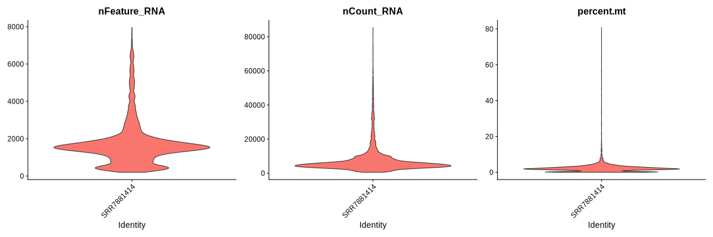
```

```{r echo=FALSE,fig.cap="Figures showing the correlation between nFeature and nCount, as well as between nCount and percent.mt", out.width = "600px" , fig.align = 'center'}
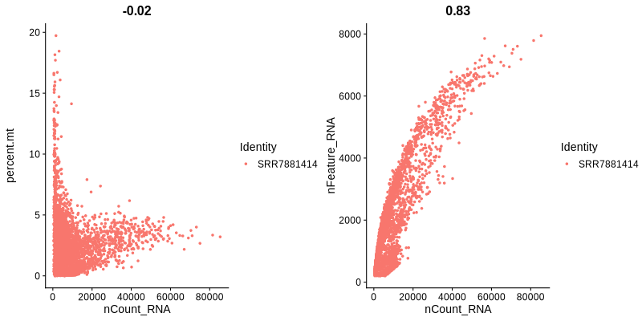
```

```{r echo=FALSE,fig.cap="Figures showing the variable features used for downstream analysis", out.width = "400px" , fig.align = 'center'}
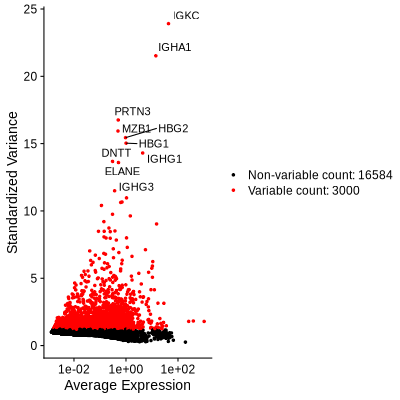
```


```{r echo=FALSE,fig.cap="ElbowPlot showing suitable number of PCs used for further analysis", out.width = "400px" , fig.align = 'center'}
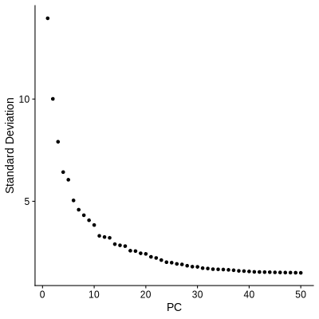
```

```{r echo=FALSE,fig.cap="UMAP plots before (left) and after (right) batch removal", out.width = "600px" , fig.align = 'center', out.width='50%', fig.show='hold', eval=FALSE}
#knitr::include_graphics("./sc_img/step2/datasets.before.batch.removal_umap_datasetID.png")
#knitr::include_graphics("./sc_img/step2/datasets.after.batch.removal_umap_datasetID.png")
```

```{r echo=FALSE,fig.cap="UMAP plot showing doublets found by DoubletFinder", out.width = "400px" , fig.align = 'center'}
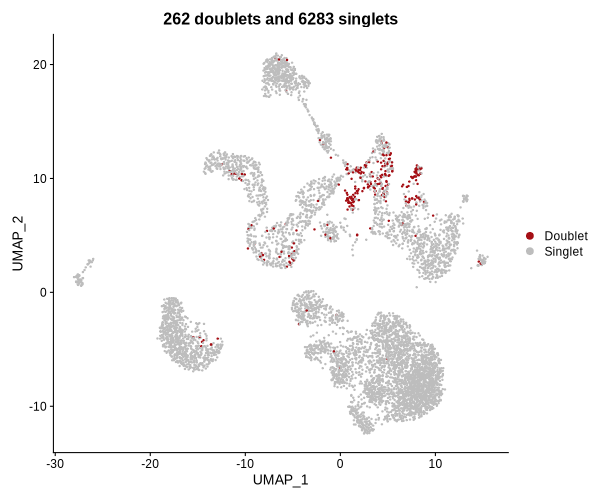
```

## Step 3. Clustering
- Create a folder for saving the results of Louvain clustering.
```{R, eval=FALSE}
print('Step3. Clustering.')
if (!file.exists(paste0(output.dir, '/Step3.Clustering/'))) {
  dir.create(paste0(output.dir, '/Step3.Clustering/'))
}   
```

- Set the parameters for clustering.
```{R, eval=FALSE}
PCs = 1:35
resolution = 0.4
n.neighbors = 50
```

- Run Louvian clustering.
```{R, eval=FALSE}
if( (length(input.data.dirs) > 1) & Step2_Quality_Control.RemoveBatches ){graph.name <- 'integrated_snn'}else{graph.name <- 'RNA_snn'}
sc_object <- FindNeighbors(sc_object, dims = PCs, k.param = n.neighbors, force.recalc = TRUE)
sc_object <- FindClusters(sc_object, resolution = resolution, graph.name = graph.name)
sc_object@meta.data$seurat_clusters <- as.character(as.numeric(sc_object@meta.data$seurat_clusters))

# plot clustering
pdf(paste0(paste0(output.dir,'/Step3.Clustering/'), '/sc_object ','tsne_cluster.pdf'), width = 6, height = 6)
 print(DimPlot(sc_object, reduction = "tsne", group.by = "seurat_clusters", label = FALSE, pt.size = 0.1, raster = FALSE))
dev.off()

pdf(paste0(paste0(output.dir,'/Step3.Clustering/'), '/sc_object ','umap_cluster.pdf'), width = 6, height = 6)
 print(DimPlot(sc_object, reduction = "umap", group.by = "seurat_clusters", label = FALSE, pt.size = 0.1, raster = FALSE))
dev.off()

png(paste0(paste0(output.dir,'/Step3.Clustering/'), '/sc_object ','tsne_cluster.png'), width = 600, height = 600)
 print(DimPlot(sc_object, reduction = "tsne", group.by = "seurat_clusters", label = FALSE, pt.size = 0.1, raster = FALSE))
dev.off()

png(paste0(paste0(output.dir,'/Step3.Clustering/'), '/sc_object ','umap_cluster.png'), width = 600, height = 600)
 print(DimPlot(sc_object, reduction = "umap", group.by = "seurat_clusters", label = FALSE, pt.size = 0.1, raster = FALSE))
dev.off()    
```
- Save the variables.
```{R, eval=FALSE}
# Get the names of all variables in the current environment
variable_names <- ls()
# Loop through the variable names and save them as RDS files
for (var_name in variable_names) {
  var <- get(var_name)  # Get the variable by its name
  saveRDS(var, file = paste0(output.dir, '/RDSfiles/', var_name, ".rds"))  # Save as RDS with the variable's name
}  
```

```{r echo=FALSE,fig.cap="UMAP plot showing clustering results", out.width = "400px" , fig.align = 'center'}
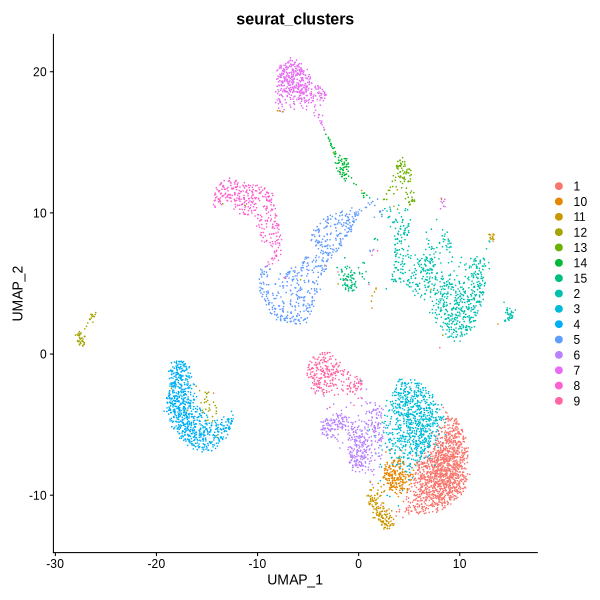
```

## Step 4. Identify Cell Types

In this step, users can predict the cell types of hematopoietic cells by implementing two approaches (Scmap and Seurat) through abcCellmap packages. Cells are labeled by 43 different RNA clusters according to unsupervised clustering of single-cell transcriptional profiles, and also labeled by 32 immunophenotypic cell types. In addition, users can use Copykat to measure copy number variation (CNV)  and determine the ploidy of each cell.

### codes for running abcCellmap

- Create a folder for saving the results of cell type identification.
```{R, eval=FALSE}
print('Step4. Identify cell types automatically.')
if (!file.exists(paste0(output.dir, '/Step4.Identify_Cell_Types/'))) {
dir.create(paste0(output.dir, '/Step4.Identify_Cell_Types/'))
} 
```

- Set the path for the database.
```{R, eval=FALSE}
databasePath = "~/HemaScopeR/database/"
```
- Set the parameters for cell type identification.
```{R, eval=FALSE}
Step4_Use_Which_Labels = 'clustering'
Step4_Cluster_Labels = NULL
Step4_Changed_Labels = NULL
Org = 'hsa'
ncores = 10
```

- Run the cell type identification process.
```{R, eval=FALSE}
sc_object <- run_cell_annotation(object = sc_object, 
                               assay = 'RNA', 
                               species = Org,
                               output.dir = paste0(output.dir,'/Step4.Identify_Cell_Types/'))

if(Org == 'hsa'){
load(paste0(databasePath,"/HematoMap.reference.rdata")) #the data can be downloaded via the link https://cloud.tsinghua.edu.cn/d/759fd04333274d3f9946
if(length(intersect(rownames(HematoMap.reference), rownames(sc_object))) < 1000){
      HematoMap.reference <- RenameGenesSeurat(obj = HematoMap.reference,
                                               newnames = toupper(rownames(HematoMap.reference)),
                                               gene.use = rownames(HematoMap.reference), 
                                               de.assay = "RNA",
                                               lassays = "RNA")
  }
  
if(sc_object@active.assay == 'integrated'){
    DefaultAssay(sc_object) <- 'RNA'
    sc_object <- mapDataToRef(ref_object = HematoMap.reference,
                              ref_labels = HematoMap.reference@meta.data$CellType,
                              query_object = sc_object,
                              PCs = PCs,
                              output.dir = paste0(output.dir, '/Step4.Identify_Cell_Types/'))
    DefaultAssay(sc_object) <- 'integrated'
}else{
    sc_object <- mapDataToRef(ref_object = HematoMap.reference,
                              ref_labels = HematoMap.reference@meta.data$CellType,
                              query_object = sc_object,
                              PCs = PCs,
                              output.dir = paste0(output.dir, '/Step4.Identify_Cell_Types/'))
}
}
```
- Set the cell labels.
```{R, eval=FALSE}
# set the cell labels
if(Step4_Use_Which_Labels == 'clustering'){
  sc_object@meta.data$selectLabels <- sc_object@meta.data$seurat_clusters
  Idents(sc_object) <- sc_object@meta.data$selectLabels
}else if(Step4_Use_Which_Labels == 'abcCellmap.1'){
  sc_object@meta.data$selectLabels <- sc_object@meta.data$Seurat.RNACluster
  Idents(sc_object) <- sc_object@meta.data$selectLabels
}else if(Step4_Use_Which_Labels == 'abcCellmap.2'){
  sc_object@meta.data$selectLabels <- sc_object@meta.data$scmap.RNACluster
  Idents(sc_object) <- sc_object@meta.data$selectLabels
}else if(Step4_Use_Which_Labels == 'abcCellmap.3'){
  sc_object@meta.data$selectLabels <- sc_object@meta.data$Seurat.Immunophenotype
  Idents(sc_object) <- sc_object@meta.data$selectLabels          
}else if(Step4_Use_Which_Labels == 'abcCellmap.4'){
  sc_object@meta.data$selectLabels <- sc_object@meta.data$scmap.Immunophenotype
  Idents(sc_object) <- sc_object@meta.data$selectLabels          
}else if(Step4_Use_Which_Labels == 'HematoMap'){
  if(Org == 'hsa'){
    sc_object@meta.data$selectLabels <- sc_object@meta.data$predicted.id
    Idents(sc_object) <- sc_object@meta.data$selectLabels
  }else{print("'HematoMap' is only applicable to human data ('Org' = 'hsa').")}    
}else if(Step4_Use_Which_Labels == 'changeLabels'){
  if (!is.null(Step4_Cluster_Labels) && !is.null(Step4_Changed_Labels) && length(Step4_Cluster_Labels) == length(Step4_Changed_Labels)){
   sc_object@meta.data$selectLabels <- plyr::mapvalues(sc_object@meta.data$seurat_clusters,
                                                       from = as.character(Step4_Cluster_Labels),
                                                       to = as.character(Step4_Changed_Labels),
                                                       warn_missing = FALSE)
   Idents(sc_object) <- sc_object@meta.data$selectLabels
  }else{
   print("Please input the 'Step4_Cluster_Labels' parameter as Seurat clustering labels, and the 'Step4_Changed_Labels' parameter as new labels. Please note that these two parameters should be of equal length.")
  }
}else{
  print('Please set the "Step4_Use_Which_Labels" parameter as "clustering", "abcCellmap.1", "abcCellmap.2", "HematoMap" or "changeLabels".')
}
```
- Save the variables.
```{R, eval=FALSE}
# Get the names of all variables in the current environment
variable_names <- ls()
# Loop through the variable names and save them as RDS files
for (var_name in variable_names) {
var <- get(var_name)  # Get the variable by its name
saveRDS(var, file = paste0(output.dir, '/RDSfiles/', var_name, ".rds"))  # Save as RDS with the variable's name
}  
```

```{r echo=FALSE,fig.cap="UMAP plots showing cell type annotation results", out.width = "400px" , fig.align = 'center'}
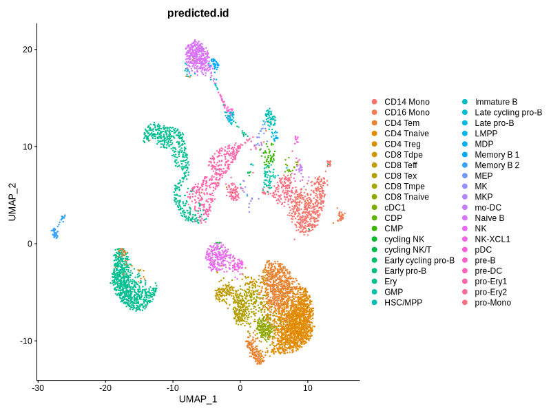
```

```{r echo=FALSE,fig.cap="Immunophenotype and RNACluster label predicted by scmap", out.width = "600px" , fig.align = 'center', out.width='50%', fig.show='hold'}
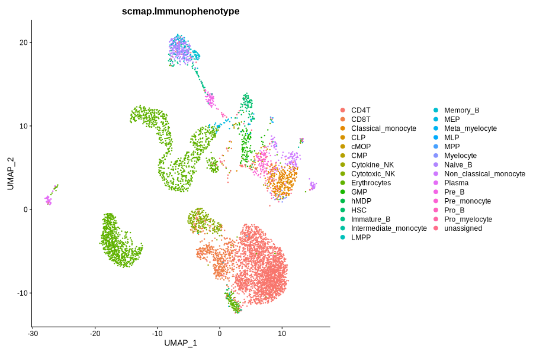
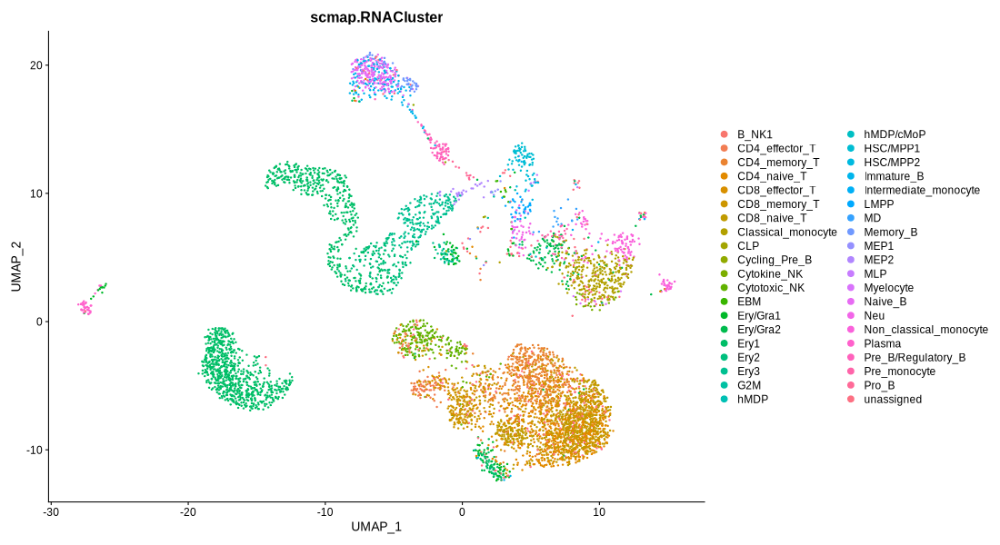
```

```{r echo=FALSE,fig.cap="Immunophenotype and RNACluster label predicted by Seurat", out.width = "600px" , fig.align = 'center', out.width='50%', fig.show='hold'}
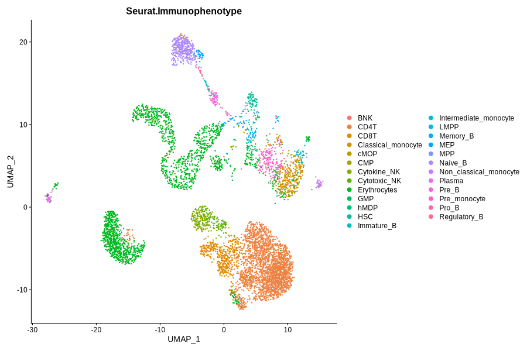
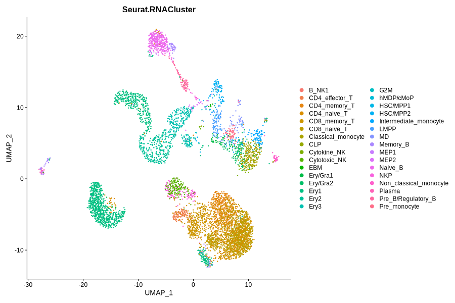
```

### codes for running the CNV analysis

```{R, eval=FALSE}
sc_CNV(sc_object=sc_object,
       save_path=paste0(output.dir,'/Step4.Identify_Cell_Types/'),
       assay = 'RNA',
       LOW.DR = 0.05, #refer to the Copykat documentation for detailed explanations of the parameters
       UP.DR = 0.1,
       win.size = 25,
       distance = "euclidean",
       genome = NULL,
       n.cores = ncores, #note: this step will take a long time, using more ncores could shorten the running time
       species = Org)
```

```{r echo=FALSE,fig.cap="copykat heatmap", out.width = "800px" , fig.align = 'center'}
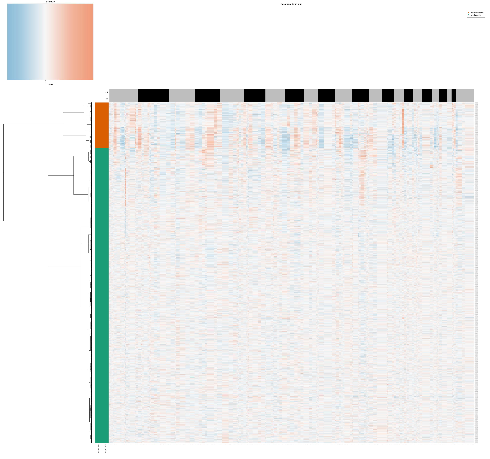
```

```{r echo=FALSE,fig.cap="UMAP plot showing CNV state predicted by copykat", out.width = "400px" , fig.align = 'center'}
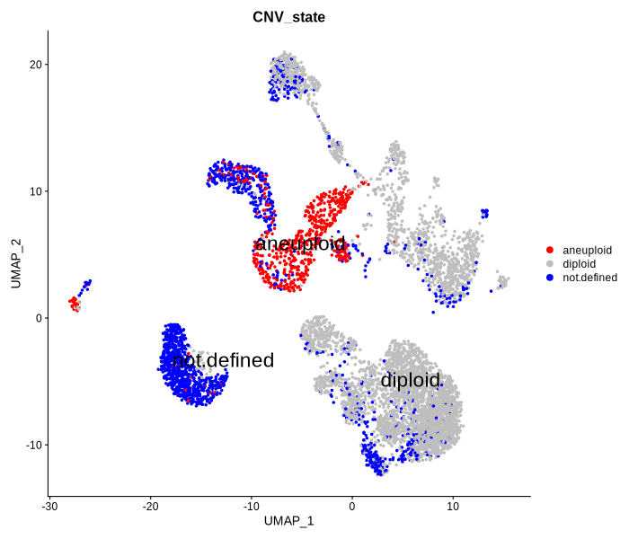
```

## Step 5. Visualization

In this step, users are allowed to gain the statistical results about the numbers and proportions of cell groups, and also use three dimensional reduction methods (TSNE, UMAP, phateR) to visualize the results.

### codes for peforming three dimensional reduction methods
- Create a folder for saving the visualization results.
```{R, eval=FALSE}
print('Step5. Visualization.')
if (!file.exists(paste0(output.dir, '/Step5.Visualization/'))) {
  dir.create(paste0(output.dir, '/Step5.Visualization/'))
}
```
- Perform visualization using UMAP and TSNE.
```{R, eval=FALSE}
# plot cell types
pdf(paste0(paste0(output.dir,'/Step5.Visualization/'), '/sc_object ','tsne cell types.pdf'), width = 6, height = 6)
 print(DimPlot(sc_object, reduction = "tsne", group.by = "ident", label = FALSE, pt.size = 0.1, raster = FALSE))
dev.off()

pdf(paste0(paste0(output.dir,'/Step5.Visualization/'), '/sc_object ','umap cell types.pdf'), width = 6, height = 6)
 print(DimPlot(sc_object, reduction = "umap", group.by = "ident", label = FALSE, pt.size = 0.1, raster = FALSE))
dev.off()

png(paste0(paste0(output.dir,'/Step5.Visualization/'), '/sc_object ','tsne cell types.png'), width = 600, height = 600)
 print(DimPlot(sc_object, reduction = "tsne", group.by = "ident", label = FALSE, pt.size = 0.1, raster = FALSE))
dev.off()

png(paste0(paste0(output.dir,'/Step5.Visualization/'), '/sc_object ','umap cell types.png'), width = 600, height = 600)
 print(DimPlot(sc_object, reduction = "umap", group.by = "ident", label = FALSE, pt.size = 0.1, raster = FALSE))
dev.off()    
```

```{r echo=FALSE,fig.cap="UMAP and TSNE visualization", out.width = "600px" , fig.align = 'center', out.width='50%', fig.show='hold'}
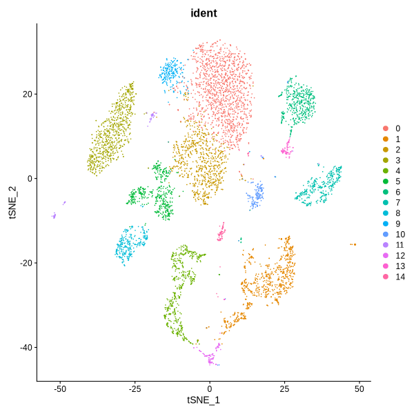
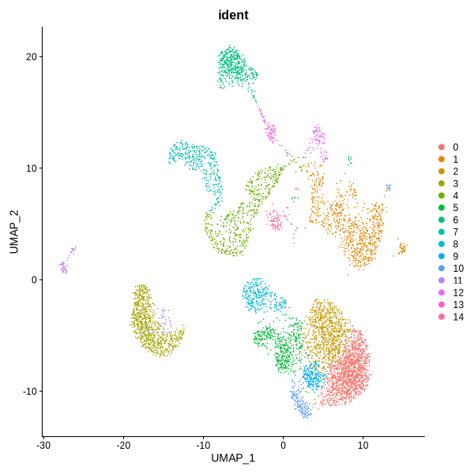
```

- Set the parameters for phateR.
```{R, eval=FALSE}
phate.knn = 50 #The number of nearest neighbors to consider in the phateR algorithm. Default 50.
phate.npca = 20 #The number of principal components to use in the phateR algorithm. Default 20.
phate.t = 10 #The t-value for the phateR algorithm, which controls the level of exploration. Default 10.
phate.ndim = 2 #The number of dimensions for the output embedding in the phateR algorithm. Default 2.
```

- Run phateR for dimensional reduction and visualization.
```{R, eval=FALSE}
# run phateR
if( (length(input.data.dirs) > 1) & Step2_Quality_Control.RemoveBatches ){
    DefaultAssay(sc_object) <- 'integrated'
}else{
    DefaultAssay(sc_object) <- 'RNA'}

if(!is.null(pythonPath)){
  run_phateR(sc_object = sc_object,
             output.dir = paste0(output.dir,'/Step5.Visualization/'),
             pythonPath = pythonPath,
             phate.knn = phate.knn,
             phate.npca = phate.npca,
             phate.t = phate.t,
             phate.ndim = phate.ndim)     
}
```

```{r echo=FALSE,fig.cap="phateR result", out.width = "400px" , fig.align = 'center'}
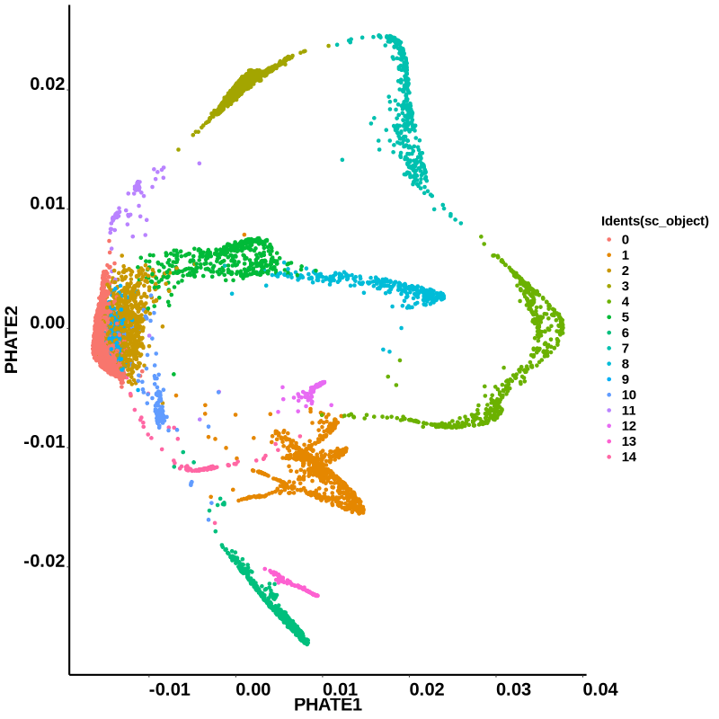
```

### codes for calculating the proportions
- The statistical results for the numbers and proportions of cell groups.
```{R, eval=FALSE}
# statistical results
cells_labels <- as.data.frame(cbind(rownames(sc_object@meta.data), as.character(sc_object@meta.data$selectLabels)))
colnames(cells_labels) <- c('cell_id', 'cluster_id')
cluster_counts <- cells_labels %>%
  group_by(cluster_id) %>%
  summarise(count = n())
total_cells <- nrow(cells_labels)
cluster_counts <- cluster_counts %>%
  mutate(proportion = count / total_cells)

cluster_counts <- as.data.frame(cluster_counts)

cluster_counts$percentages <- scales::percent(cluster_counts$proportion, accuracy = 0.1)
cluster_counts <- cluster_counts[,-which(colnames(cluster_counts)=='proportion')]

cluster_counts$cluster_id_count_percentages <- paste(cluster_counts$cluster_id, " (", cluster_counts$count, ' cells; ', cluster_counts$percentages, ")", sep='')

cluster_counts <- cluster_counts[order(cluster_counts$count, decreasing = TRUE),]

cluster_counts <- rbind(cluster_counts, c('Total', sum(cluster_counts$count), '100%', 'all cells'))

sc_object@meta.data$cluster_id_count_percentages <- mapvalues(sc_object@meta.data$selectLabels, 
                                                              from=cluster_counts$cluster_id, 
                                                              to=cluster_counts$cluster_id_count_percentages,
                                                              warn_missing=FALSE)

colnames(sc_object@meta.data)[which(colnames(sc_object@meta.data) == 'cluster_id_count_percentages')] <- paste('Total ', nrow(sc_object@meta.data), ' cells', sep='')

cluster_counts <- cluster_counts[,-which(colnames(cluster_counts)=='cluster_id_count_percentages')]

colnames(cluster_counts) <- c('Cell types', 'Cell counts', 'Percentages')

# names(colorvector) <- mapvalues(names(colorvector), 
#                                 from=cluster_counts$cluster_id, 
#                                 to=cluster_counts$cluster_id_count_percentages,
#                                 warn_missing=FALSE)

write.csv(cluster_counts, file=paste(paste0(output.dir, '/Step5.Visualization/'), '/cell types_cell counts_percentages.csv', sep=''), quote=FALSE, row.names=FALSE)
```

- The UMAP visualization.
```{R, eval=FALSE}
pdf(paste(paste0(output.dir, '/Step5.Visualization'), '/cell types_cell counts_percentages_umap.pdf', sep=''), width = 14, height = 6)
  print(DimPlot(sc_object, 
                reduction = "umap", 
                group.by = paste('Total ', nrow(sc_object@meta.data), ' cells', sep=''), 
                label = FALSE, 
                pt.size = 0.1, 
                raster = FALSE))
dev.off()
```

- Save the variables.
```{R, eval=FALSE}
# Get the names of all variables in the current environment
variable_names <- ls()
# Loop through the variable names and save them as RDS files
for (var_name in variable_names) {
  var <- get(var_name)  # Get the variable by its name
  saveRDS(var, file = paste0(output.dir, '/RDSfiles/', var_name, ".rds"))  # Save as RDS with the variable's name
}  
```

```{r echo=FALSE,fig.cap="UMAP plot showing cell type and corresponding proportion", out.width = "800px" , fig.align = 'center'}
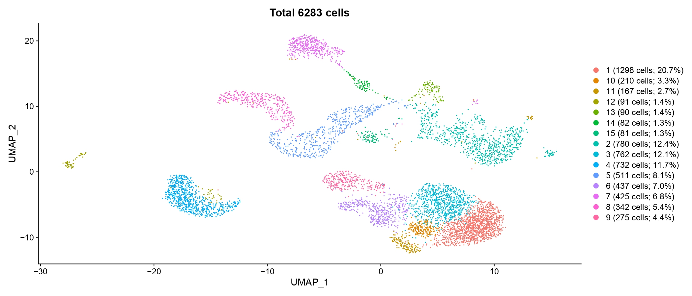
```

## Step 6. Find DEGs

In this step, users can find DEGs (differentially expressed genes) across different cell type group using FindAllMarkers, use GPTCelltype to predict cell label, perform GO and KEGG enrichment analysis, and perform subnetwork analysis for each cell type group.

### codes for finding DEGs
- Set the parameters for identifying differentially expressed genes.
```{R, eval=FALSE}
min.pct = 0.25
logfc.threshold = 0.25
```
- Create a folder for the DEGs analysis.
```{R, eval=FALSE}
print('Step6. Find DEGs.')
if (!file.exists(paste0(output.dir, '/Step6.Find_DEGs/'))) {
  dir.create(paste0(output.dir, '/Step6.Find_DEGs/'))
}   
```
- Identify DEGs using Wilcoxon Rank-Sum Test.
```{R, eval=FALSE}
sc_object.markers <- FindAllMarkers(sc_object, only.pos = TRUE, min.pct = min.pct, logfc.threshold = logfc.threshold)
write.csv(sc_object.markers,
          file = paste0(paste0(output.dir, '/Step6.Find_DEGs/'),'sc_object.markerGenes.csv'),
          quote=FALSE)

# visualization
sc_object.markers.top5 <- sc_object.markers %>% group_by(cluster) %>% top_n(n = 5, wt = avg_log2FC)

pdf(paste0(paste0(output.dir, '/Step6.Find_DEGs/'), 'sc_object_markerGenesTop5.pdf'), 
    width = 0.5*length(unique(sc_object.markers.top5$gene)), 
    height = 0.5*length(unique(Idents(sc_object))))
    print(DotPlot(sc_object,
            features = unique(sc_object.markers.top5$gene),
            cols=c("lightgrey",'red'))+theme(axis.text.x =element_text(angle = 45, vjust = 1, hjust = 1)))
dev.off()

png(paste0(paste0(output.dir, '/Step6.Find_DEGs/'), 'sc_object_markerGenesTop5.png'), 
    width = 20*length(unique(sc_object.markers.top5$gene)), 
    height = 30*length(unique(Idents(sc_object))))
    print(DotPlot(sc_object,
            features = unique(sc_object.markers.top5$gene),
            cols=c("lightgrey",'red'))+theme(axis.text.x =element_text(angle = 45, vjust = 1, hjust = 1)))
dev.off()
```

```{r echo=FALSE,fig.cap="Dotplot showing marker genes of each cell type group", out.width = "600px" , fig.align = 'center'}
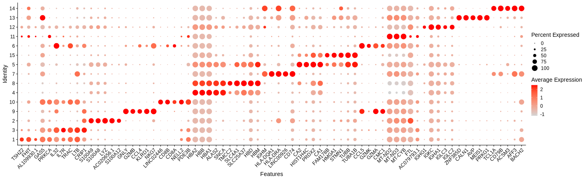
```

### codes for using GPTCelltype
- Set the parameters for GPTCelltype.
```{R, eval=FALSE}
your_openai_API_key = ''
tissuename = 'human bone marrow'
gptmodel = 'gpt-3.5'
```
- Use GPTCelltype to assist cell type annotation.
```{R, eval=FALSE}
GPT_annotation( marker.genes = sc_object.markers,
                your_openai_API_key = your_openai_API_key,
                tissuename = tissuename,
                gptmodel = gptmodel,
                output.dir = paste0(output.dir, '/Step6.Find_DEGs/'))
```

### Perform GO and KEGG enrichment.
```{R, eval=FALSE}
# GO enrichment
if(Org=='mmu'){
  OrgDb <- 'org.Mm.eg.db'
}else if(Org=='hsa'){
  OrgDb <- 'org.Hs.eg.db'
}else{
  stop("Org should be 'mmu' or 'hsa'.")
}

HemaScopeREnrichment(DEGs=sc_object.markers,
                     OrgDb=OrgDb,
                     output.dir=paste0(output.dir, '/Step6.Find_DEGs/'))
```

```{r echo=FALSE,fig.cap="Barplot showing GO（BP）and KEGG enrichment results of each cell type group", out.width = "400px", fig.align = 'center', out.width='50%', fig.show='hold'}
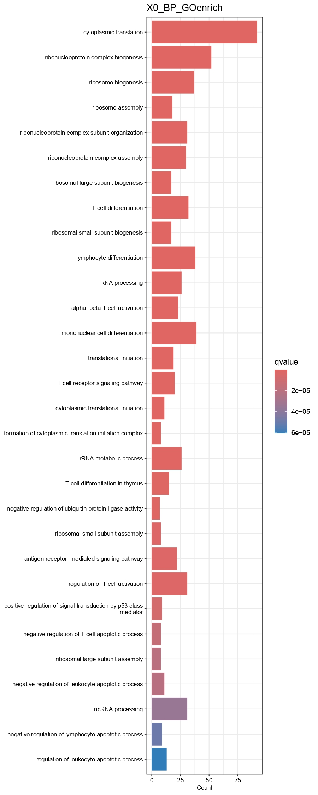
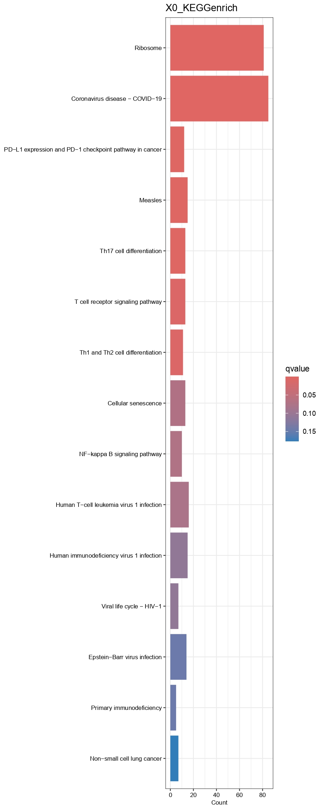
```

### Perform subnetwork analysis
- Create a folder for saving the results of gene network analysis.
```{R, eval=FALSE}
if (!file.exists(paste0(output.dir, '/Step6.Find_DEGs/OpenXGR/'))) {
  dir.create(paste0(output.dir, '/Step6.Find_DEGs/OpenXGR/'))
}
```
- Perform gene network analysis.
```{R, eval=FALSE}
OpenXGR_SAG(sc_object.markers = sc_object.markers,
            output.dir = paste0(output.dir, '/Step6.Find_DEGs/OpenXGR/'),
            subnet.size = 10)
```
- Save the variables.
```{R, eval=FALSE}
# Get the names of all variables in the current environment
variable_names <- ls()
# Loop through the variable names and save them as RDS files
for (var_name in variable_names) {
  var <- get(var_name)  # Get the variable by its name
  saveRDS(var, file = paste0(output.dir, '/RDSfiles/', var_name, ".rds"))  # Save as RDS with the variable's name
}  
```

```{r echo=FALSE,fig.cap="Figure showing subnetwork of each cell type group identified by OpenXGR", out.width = "400px" , fig.align = 'center'}
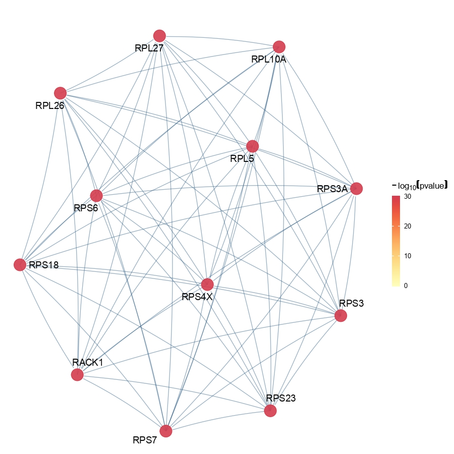
```

## Step 7. Assign Cell Cycles

This step assigns cell cycle phases by analyzing cell cycle-related genes and generates plots of the cell cycle analysis results. 

### Function arguments:
* `sc_object`: A Seurat object containing single-cell RNA sequencing data.
* `counts_matrix`: The 'counts' slot in the Seurat object.
* `data_matrix`: The 'data' slot in the Seurat object.
* `cellcycleCutoff`: The cutoff value for distinguishing between cycling and quiescent cells. Cells with a G1G2Score below this cutoff are considered quiescent.
* `cellTypeOrders`: The order of cell types for visualization. If not provided, the function will use the unique cell types in the input Seurat object.
* `databasePath`: The path to the database required for the analysis.
* `Org`: A character vector specifying the species of cell cycle genes, can be 'mmu' (mouse) or 'hsa' (human).

### codes for step7
- Create a folder for saving the results of cell cycle analysis.
```{R, eval=FALSE}
print('Step7. Assign cell cycles.')
if (!file.exists(paste0(output.dir, '/Step7.Assign_cell_cycles/'))) {
  dir.create(paste0(output.dir, '/Step7.Assign_cell_cycles/'))
}
```
- Set the parameters for the cell cycle analysis.
```{R, eval=FALSE}
cellcycleCutoff = NULL
```
- Run the cell cycle analysis.
```{R, eval=FALSE}
datasets.before.batch.removal <- readRDS(paste0(paste0(output.dir, '/RDSfiles/'),'datasets.before.batch.removal.rds'))  
sc_object <- cellCycle(sc_object=sc_object,
                       counts_matrix = GetAssayData(object = datasets.before.batch.removal, slot = "counts")%>%as.matrix(),
                       data_matrix = GetAssayData(object = datasets.before.batch.removal, slot = "data")%>%as.matrix(),
                       cellcycleCutoff = cellcycleCutoff,
                       cellTypeOrders = unique(sc_object@meta.data$selectLabels),
                       output.dir=paste0(output.dir, '/Step7.Assign_cell_cycles/'),
                       databasePath = databasePath,
                       Org = Org)
```
- Save the variables.
```{R, eval=FALSE}
# Get the names of all variables in the current environment
variable_names <- ls()
# Loop through the variable names and save them as RDS files
for (var_name in variable_names) {
  var <- get(var_name)  # Get the variable by its name
  saveRDS(var, file = paste0(output.dir, '/RDSfiles/', var_name, ".rds"))  # Save as RDS with the variable's name
}  
```

### Outputs
```{r echo=FALSE,fig.cap="Barplot showing the proportion of different cell cycle within each cell type group", out.width = "400px" , fig.align = 'center'}
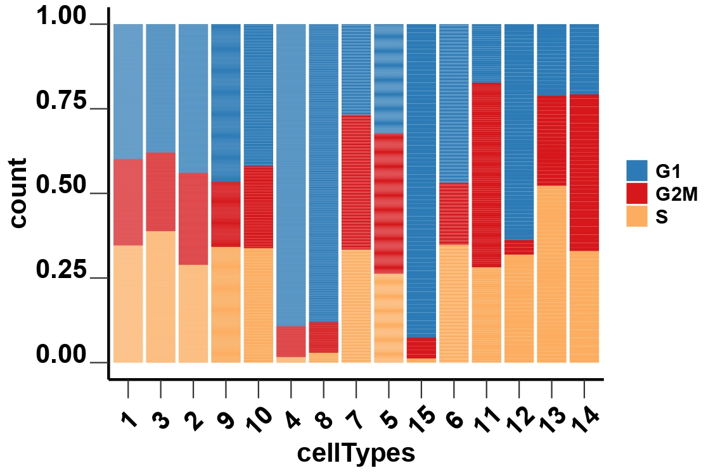
```

```{r echo=FALSE,fig.cap="Density plot showing the distribution of cell cycle scores", out.width = "400px" , fig.align = 'center'}
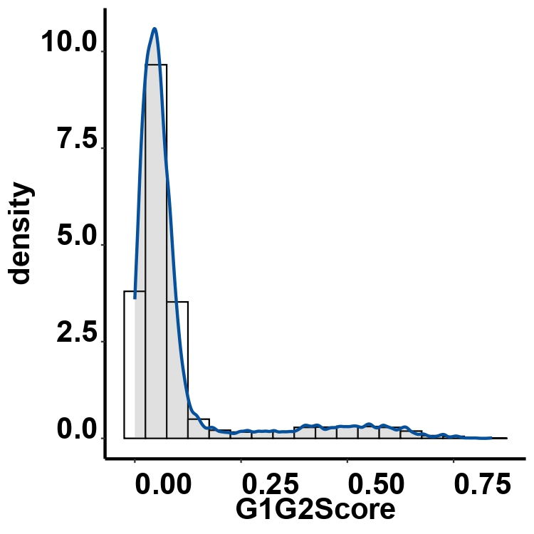
```

## Step 8. Calculate Heterogeneity

This step quantifies cell heterogeneity by computing Spearman correlation coefficients between cells within the same cell type groups.

### Function arguments:
* `expression_matrix`: A numeric matrix representing the expression data, where rows are genes and columns are cells. The matrix should be appropriately preprocessed and filtered before using this function.
* `cell_types_groups`: A data frame specifying cell type annotations for each cell, including cell type labels and group information.
* `cellTypeOrders`: The order of cell types for visualization. If not provided, the function will use the unique cell types in the input cell_types_groups.

### codes for step8
- Create a folder for saving the results of heterogeneity calculation.
```{R, eval=FALSE}
print('Step8. Calculate heterogeneity.')
if (!file.exists(paste0(output.dir, '/Step8.Calculate_heterogeneity/'))) {
  dir.create(paste0(output.dir, '/Step8.Calculate_heterogeneity/'))
}  
```
- Run heterogeneity calculation process.
```{R, eval=FALSE}
expression_matrix <- GetAssayData(object = datasets.before.batch.removal, slot = "data")%>%as.matrix()
expression_matrix <- expression_matrix[,rownames(sc_object@meta.data)]
cell_types_groups <- as.data.frame(cbind(sc_object@meta.data$selectLabels,
                                         sc_object@meta.data$datasetID))
colnames(cell_types_groups) <- c('clusters', 'datasetID')

if(is.null(ViolinPlot.cellTypeOrders)){
  cellTypes_orders <- unique(sc_object@meta.data$selectLabels)
}else{
  cellTypes_orders <- ViolinPlot.cellTypeOrders  
} 

heterogeneity(expression_matrix = expression_matrix,
              cell_types_groups = cell_types_groups,
              cellTypeOrders = cellTypes_orders,
              output.dir = paste0(output.dir, '/Step8.Calculate_heterogeneity/'))
```
- Save the variables.
```{R, eval=FALSE}
# Get the names of all variables in the current environment
variable_names <- ls()
# Loop through the variable names and save them as RDS files
for (var_name in variable_names) {
  var <- get(var_name)  # Get the variable by its name
  saveRDS(var, file = paste0(output.dir, '/RDSfiles/', var_name, ".rds"))  # Save as RDS with the variable's name
} 
```

```{r echo=FALSE,fig.cap="Box plot showing the Spearman correlation coefficients between cells within the same cell type groups(here we take data including more samples as an example)", out.width = "400px" , fig.align = 'center'}
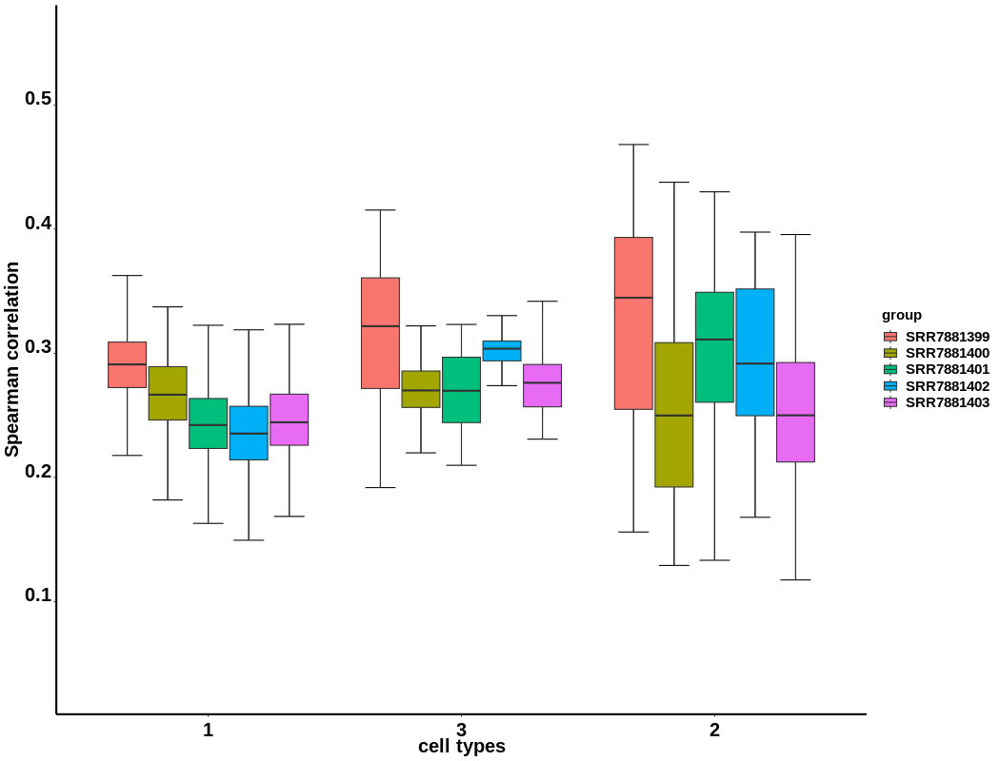
```

## Step 9. Violin Plot for Marker Genes

This step generates violin plots for marker genes across different cell types.

### Function arguments:
* `dataMatrix`: A data frame or matrix representing the expression data, where rows are cells and columns are genes.
* `features`: A character vector specifying the marker genes to plot in the violin plots.
* `CellTypes`: A factor vector containing cell type annotations for each cell.
* `cellTypeOrders`: A character vector specifying the order of cell types for plotting. Defaults to unique values in `CellTypes`.
* `cellTypeColors`: A character vector specifying the colors to use for cell type groups. Defaults to a color palette.

### codes for step9
- Create a folder for saving the violin plots of marker genes.
```{R, eval=FALSE}
print('Step9. Violin plot for marker genes.')
if (!file.exists(paste0(output.dir, '/Step9.Violin_plot_for_marker_genes/'))) {
  dir.create(paste0(output.dir, '/Step9.Violin_plot_for_marker_genes/'))
}
```
- Run violin plot visualization.
```{R, eval=FALSE}
if( (length(input.data.dirs) > 1) & Step2_Quality_Control.RemoveBatches ){
    DefaultAssay(sc_object) <- 'integrated'
}else{
    DefaultAssay(sc_object) <- 'RNA'}

dataMatrix <- GetAssayData(object = sc_object, slot = "scale.data")

if(is.null(marker.genes)&(Org == 'mmu')){
    # mpp genes are from 'The bone marrow microenvironment at single cell resolution'
    # the other genes are from 'single cell characterization of haematopoietic progenitors and their trajectories in homeostasis and perturbed haematopoiesis'
    # the aliases of these genes were changed in gecodeM16：Gpr64 -> Adgrg2, Sdpr -> Cavin2, Hbb-b1 -> Hbb-bs, Sfpi1 -> Spi1
    HSC_lineage_signatures <- c('Slamf1', 'Itga2b', 'Kit', 'Ly6a', 'Bmi1', 'Gata2', 'Hlf', 'Meis1', 'Mpl', 'Mcl1', 'Gfi1', 'Gfi1b', 'Hoxb5')
    Mpp_genes <- c('Mki67', 'Mpo', 'Elane', 'Ctsg', 'Calr')
    Erythroid_lineage_signatures <- c('Klf1', 'Gata1', 'Mpl', 'Epor', 'Vwf', 'Zfpm1', 'Fhl1', 'Adgrg2', 'Cavin2','Gypa', 'Tfrc', 'Hbb-bs', 'Hbb-y')
    Lymphoid_lineage_signatures <- c('Tcf3', 'Ikzf1', 'Notch1', 'Flt3', 'Dntt', 'Btg2', 'Tcf7', 'Rag1', 'Ptprc', 'Ly6a', 'Blnk')
    Myeloid_lineage_signatures <- c('Gfi1', 'Spi1', 'Mpo', 'Csf2rb', 'Csf1r', 'Gfi1b', 'Hk3', 'Csf2ra', 'Csf3r', 'Sp1', 'Fcgr3')
    marker.genes <- c(HSC_lineage_signatures, Mpp_genes, Erythroid_lineage_signatures, Lymphoid_lineage_signatures, Myeloid_lineage_signatures)
}else if(is.null(marker.genes)&(Org == 'hsa')){
    HSPCs_lineage_signatures <- c('CD34','KIT','AVP','FLT3','MME','CD7','CD38','CSF1R','FCGR1A','MPO','ELANE','IL3RA')
    Myeloids_lineage_signatures <- c('LYZ','CD36','MPO','FCGR1A','CD4','CD14','CD300E','ITGAX','FCGR3A','FLT3','AXL',
                  'SIGLEC6','CLEC4C','IRF4','LILRA4','IL3RA','IRF8','IRF7','XCR1','CD1C','THBD',
                  'MRC1','CD34','KIT','ITGA2B','PF4','CD9','ENG','KLF','TFRC')
    B_cells_lineage_signatures <- c('CD79A','IGLL1','RAG1','RAG2','VPREB1','MME','IL7R','DNTT','MKI67','PCNA','TCL1A','MS4A1','IGHD','CD27','IGHG3')
    T_NK_cells_lineage_signatures <- c('CD3D','CD3E','CD8A','CCR7','IL7R','SELL','KLRG1','CD27','GNLY',
                    'NKG7','PDCD1','TNFRSF9','LAG3','CD160','CD4','CD40LG','IL2RA',
                    'FOXP3','DUSP4','IL2RB','KLRF1','FCGR3A','NCAM1','XCL1','MKI67','PCNA','KLRF')
    marker.genes <- c(HSPCs_lineage_signatures, Myeloids_lineage_signatures, B_cells_lineage_signatures, T_NK_cells_lineage_signatures)
}

if(is.null(ViolinPlot.cellTypeOrders)){
  ViolinPlot.cellTypeOrders <- unique(sc_object@meta.data$selectLabels)
}

if(is.null(ViolinPlot.cellTypeColors)){
  ViolinPlot.cellTypeColors <- viridis::viridis(length(unique(sc_object@meta.data$selectLabels)))
}

combinedViolinPlot(dataMatrix = dataMatrix,
                   features = marker.genes,
                   CellTypes = sc_object@meta.data$selectLabels,
                   cellTypeOrders = ViolinPlot.cellTypeOrders,
                   cellTypeColors = ViolinPlot.cellTypeColors,
                   Org = Org,
                   output.dir = paste0(output.dir, '/Step9.Violin_plot_for_marker_genes/'),
                   databasePath = databasePath)
```
- Save the variables.
```{R, eval=FALSE}
# Get the names of all variables in the current environment
variable_names <- ls()
# Loop through the variable names and save them as RDS files
for (var_name in variable_names) {
  var <- get(var_name)  # Get the variable by its name
  saveRDS(var, file = paste0(output.dir, '/RDSfiles/', var_name, ".rds"))  # Save as RDS with the variable's name
}  
```

```{r echo=FALSE,fig.cap="Violin plot showing the expression of marker genes between cell type groups", out.width = "400px" , fig.align = 'center'}
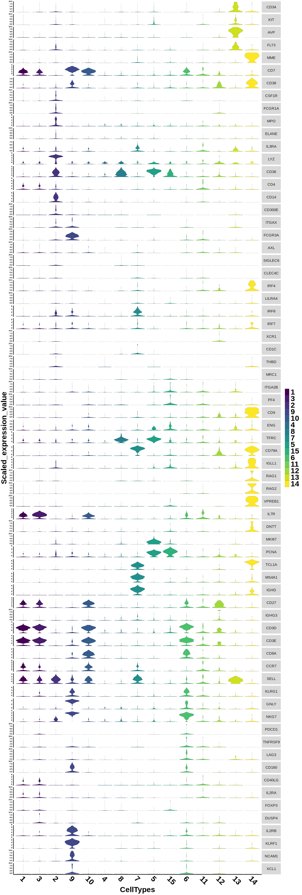
```

## Step 10. Calculate Lineage Scores

This step calculates lineage scores for specified gene sets based on the provided expression data. It then generates a heatmap of lineage scores and a heatmap of gene expression patterns.

### Function arguments:
* `expression_matrix`: A data frame or matrix representing the expression data, where rows are cells and columns are genes.
* `cellTypes`: A character vector specifying cell type annotations for each cell. e.g. c("HSC","HSC","HSC","MPP1","MPP2","MPP2","MPP2" ...)
* `cellTypes_orders`: A character vector specifying the order of cell types for plotting. e.g. c("HSC","MPP1","MPP2")
* `cellTypes_colors`: A character vector specifying the colors to use for cell type groups. e.g. c("HSC" = '#006d2c',"MPP1" = '#4292c6',"MPP2"= '#810f7c').
* `groups`: A character vector specifying groups or clusters within each cell type.
* `groups_orders`: A character vector specifying the order of groups or clusters for plotting.
* `groups_colors`: A character vector specifying the colors to use for group or cluster annotations. e.g. c('group1'='#d73027','group2'='#2171b5')
* `lineage.genelist`: A list of gene sets representing lineage markers.
* `lineage.names`: A character vector specifying the names of the lineages.

### codes for step10
- Create a folder for saving the results of lineage score calculation.
```{R, eval=FALSE}
print('Step10. Calculate lineage scores.')
# we use normalized data here
if (!file.exists(paste0(output.dir, '/Step10.Calculate_lineage_scores/'))) {
  dir.create(paste0(output.dir, '/Step10.Calculate_lineage_scores/'))
}
```
- Run lineage score calculation.
```{R, eval=FALSE}
if(is.null(lineage.genelist)&is.null(lineage.names)&(Org == 'mmu')){
    lineage.genelist <- c(list(HSC_lineage_signatures),
                          list(Mpp_genes),
                          list(Erythroid_lineage_signatures),
                          list(Lymphoid_lineage_signatures),
                          list(Myeloid_lineage_signatures))
    lineage.names <- c('HSC_lineage_signatures',
                       'Mpp_genes',
                       'Erythroid_lineage_signatures',
                       'Lymphoid_lineage_signatures',
                       'Myeloid_lineage_signatures')
}else if(is.null(lineage.genelist)&is.null(lineage.names)&(Org == 'hsa')){
    lineage.genelist <- c(list(HSPCs_lineage_signatures),
                          list(Myeloids_lineage_signatures),
                          list(B_cells_lineage_signatures),
                          list(T_NK_cells_lineage_signatures))
    lineage.names <- c('HSPCs_lineage_signatures',
                       'Myeloids_lineage_signatures',
                       'B_cells_lineage_signatures',
                       'T_NK_cells_lineage_signatures') 
}

if(is.null(ViolinPlot.cellTypeOrders)){
  cellTypes_orders <- unique(sc_object@meta.data$selectLabels)
}else{
  cellTypes_orders <- ViolinPlot.cellTypeOrders  
}
    
lineageScores(expression_matrix = expression_matrix,
              cellTypes = sc_object@meta.data$selectLabels,
              cellTypes_orders = cellTypes_orders,
              cellTypes_colors = ViolinPlot.cellTypeColors,
              groups = sc_object@meta.data$datasetID,
              groups_orders = unique(sc_object@meta.data$datasetID),
              groups_colors = groups_colors,
              lineage.genelist = lineage.genelist,
              lineage.names = lineage.names,
              Org = Org,
              output.dir = paste0(output.dir, '/Step10.Calculate_lineage_scores/'),
              databasePath = databasePath)
```
- Save the variables.
```{R, eval=FALSE}
# Get the names of all variables in the current environment
variable_names <- ls()
# Loop through the variable names and save them as RDS files
for (var_name in variable_names) {
  var <- get(var_name)  # Get the variable by its name
  saveRDS(var, file = paste0(output.dir, '/RDSfiles/', var_name, ".rds"))  # Save as RDS with the variable's name
} 
```

```{r echo=FALSE,fig.cap="Heatmap showing the expression of lineage genes for each cell", out.width = "400px" , fig.align = 'center'}
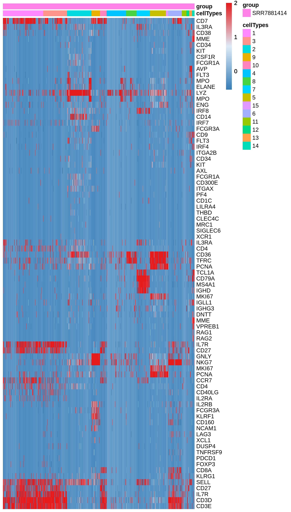
```

```{r echo=FALSE,fig.cap="Heatmap showing the score of lineage signatures for  each cell", out.width = "800px" , fig.align = 'center'}
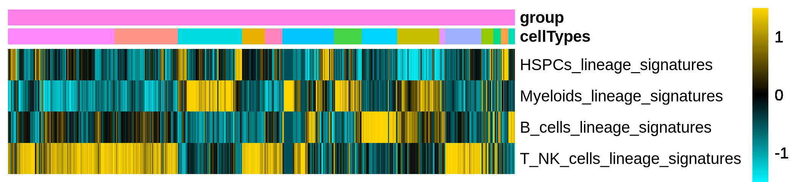
```

## Step 11. GSVA

This step runs GSVA analysis, which calculates enrichment scores for gene sets in each cell using the provided gene list. It also performs differential GSVA analysis between specified cell groups and generates heatmaps of the results.

###  Function arguments:
* `sc_object`: A Seurat object containing the single-cell RNA-seq data.
* `GSVA.genelist`: A list of gene sets for GSVA analysis.
* `GSVA.cellTypes`: A character vector specifying the cell types or labels for each cell.
* `GSVA.cellTypes.orders`: A character vector specifying the order of cell types for visualization.
* `GSVA.cellGroups`: A character vector specifying the cell groups or conditions for each cell.
* `GSVA.identify.cellType.features`: Logical. If TRUE, identify cell type-specific features.
* `GSVA.identify.diff.features`: Logical. If TRUE, identify differentially expressed features between cell groups.
* `GSVA.comparison.design`: A list specifying the experimental design for differential GSVA analysis.
* `OrgDB`: An organism-specific annotation database (OrgDb) for gene symbol conversion. e.g. org.Mm.eg.db or org.Hs.eg.db.


### codes for running step11
- Create a folder for saving the results of GSVA.
```{R, eval=FALSE}
print('Step11. GSVA.')
if (!file.exists(paste0(output.dir, '/Step11.GSVA/'))) {
  dir.create(paste0(output.dir, '/Step11.GSVA/'))
} 
```
- Run GSVA.
```{R, eval=FALSE}
setwd(wdir)

if(Org=='mmu'){
  load(paste0(databasePath,"/mouse_c2_v5p2.rdata"))
  GSVA.genelist <- Mm.c2
  assign('OrgDB', org.Mm.eg.db)
}else if(Org=='hsa'){
  load(paste0(databasePath,"/human_c2_v5p2.rdata"))
  GSVA.genelist <- Hs.c2
  assign('OrgDB', org.Hs.eg.db)
}else{
  stop("Org should be 'mmu' or 'hsa'.")
}

if(is.null(ViolinPlot.cellTypeOrders)){
  cellTypes_orders <- unique(sc_object@meta.data$selectLabels)
}else{
  cellTypes_orders <- ViolinPlot.cellTypeOrders  
}    
run_GSVA(sc_object = sc_object,
         GSVA.genelist = GSVA.genelist,
         GSVA.cellTypes = sc_object@meta.data$selectLabels,
         GSVA.cellTypes.orders = cellTypes_orders,
         GSVA.cellGroups = sc_object@meta.data$datasetID,
         GSVA.identify.cellType.features = Step11_GSVA.identify.cellType.features,
         GSVA.identify.diff.features = Step11_GSVA.identify.diff.features,
         GSVA.comparison.design = Step11_GSVA.comparison.design,
         OrgDB = OrgDB,
         output.dir = paste0(output.dir, '/Step11.GSVA/'))
```
- Save the variables.
```{R, eval=FALSE}
# Get the names of all variables in the current environment
variable_names <- ls()
# Loop through the variable names and save them as RDS files
for (var_name in variable_names) {
  var <- get(var_name)  # Get the variable by its name
  saveRDS(var, file = paste0(output.dir, '/RDSfiles/', var_name, ".rds"))  # Save as RDS with the variable's name
}  
```

```{r echo=FALSE,fig.cap="GSVA Heatmap showing the enriched pathways of each cell type group", out.width = "800px" , fig.align = 'center'}
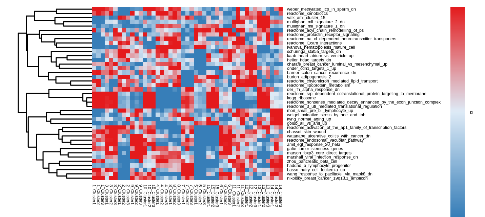
```

## Step 12. Construct Trajectories

In this step, users are allowed to construct trajectories using three methods including Monocle2, slingshot and scVelo.

### data preparation
- Load gene symbols and ensemble IDs.
```{R, eval=FALSE}
DefaultAssay(sc_object) <- 'RNA'
countsSlot <- GetAssayData(object = sc_object, slot = "counts")
gene_metadata <- as.data.frame(rownames(countsSlot))
rownames(gene_metadata) <- gene_metadata[,1]        
if(Org == 'mmu'){
   load(paste0(databasePath,"/mouseGeneSymbolandEnsembleID.rdata"))
   gene_metadata $ ensembleID <- mapvalues(x = gene_metadata[,1],
                                           from = mouseGeneSymbolandEnsembleID$geneName,
                                           to = mouseGeneSymbolandEnsembleID$ensemblIDNoDot,
                                           warn_missing = FALSE)
}else if(Org == 'hsa'){
   load(paste0(databasePath,"/humanGeneSymbolandEnsembleID.rdata"))
   gene_metadata $ ensembleID <- mapvalues(x = gene_metadata[,1],
                                           from = humanGeneSymbolandEnsembleID$geneName,
                                           to = humanGeneSymbolandEnsembleID$ensemblIDNoDot,
                                           warn_missing = FALSE) 
}
colnames(gene_metadata) <- c('gene_short_name','ensembleID')
```
- Create folders for saving the results of trajectory construction.
```{R, eval=FALSE}
print('Step12. Construct trajectories.')
if (!file.exists(paste0(output.dir, '/Step12.Construct_trajectories/'))) {
  dir.create(paste0(output.dir, '/Step12.Construct_trajectories/'))
}

if (!file.exists(paste0(output.dir, '/Step12.Construct_trajectories/monocle2/'))) {
  dir.create(paste0(output.dir, '/Step12.Construct_trajectories/monocle2/'))
} 

if (!file.exists(paste0(output.dir, '/Step12.Construct_trajectories/slingshot/'))) {
  dir.create(paste0(output.dir, '/Step12.Construct_trajectories/slingshot/'))
} 

if (!file.exists(paste0(output.dir, '/Step12.Construct_trajectories/scVelo/'))) {
  dir.create(paste0(output.dir, '/Step12.Construct_trajectories/scVelo/'))
} 
```
- Prepare the input data.
```{R, eval=FALSE}
if(is.null(Step12_Construct_Trajectories.clusters)){
    sc_object.subset <- sc_object
    countsSlot.subset <- GetAssayData(object = sc_object.subset, slot = "counts")
}else{
    sc_object.subset <- subset(sc_object, subset = selectLabels %in% Step12_Construct_Trajectories.clusters)
    countsSlot.subset <- GetAssayData(object = sc_object.subset, slot = "counts")
}
```

### monocle2

Running monocle2 involves several steps:

1. Creating a Monocle cellDataSet using the provided cellData, phenoData, and featureData.

2. Estimating size factors, dispersions, and detecting highly variable genes.

3. Performing differential gene expression analysis to identify genes associated with cell state changes.

4. Ordering cells along the inferred trajectories and reducing dimensionality.

5. Generating and saving trajectory plots, including cell trajectory by "State" and by "Cell Types."

####  Function arguments:
* `cellData`: A matrix of gene expression values, where columns represent cells and rows represent genes.
* `phenoData`: A data frame containing cell metadata, such as cell labels or other relevant information.
* `featureData`: A data frame containing information about features (genes) in the dataset.
* `lowerDetectionLimit`: The lower detection limit for gene expression. Genes with expression values below this limit will be treated as non-detected.
* `expressionFamily`: The family of the expression distribution used in Monocle analysis.
* `cellTypes`: A character vector specifying cell types or labels used for coloring in trajectory plots.
* `monocle.orders`: A character vector specifying the order of cell types in the Monocle analysis.
* `monocle.colors`: A character vector specifying colors for cell types in trajectory plots.


#### codes for running monocle2
```{R, eval=FALSE}
phenoData <- sc_object.subset@meta.data
featureData <- gene_metadata
run_monocle(cellData = countsSlot.subset,
            phenoData = phenoData,
            featureData = featureData,
            lowerDetectionLimit = 0.5,
            expressionFamily = VGAM::negbinomial.size(),
            cellTypes='selectLabels',
            monocle.orders=Step12_Construct_Trajectories.clusters,
            monocle.colors = ViolinPlot.cellTypeColors,
            output.dir = paste0(output.dir, '/Step12.Construct_trajectories/monocle2/'))
```

```{r echo=FALSE,fig.cap="Figures showing cells in different trajectory states (left) and corresponding cell type groups (right)", out.width = "400px" , fig.align = 'center', out.width='50%', fig.show='hold'}
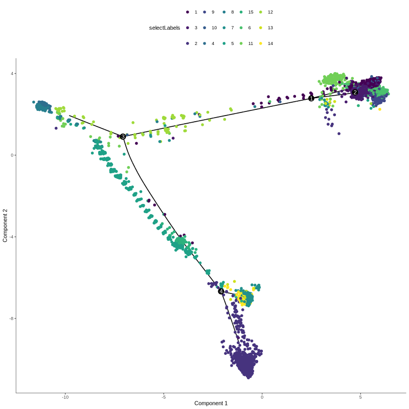
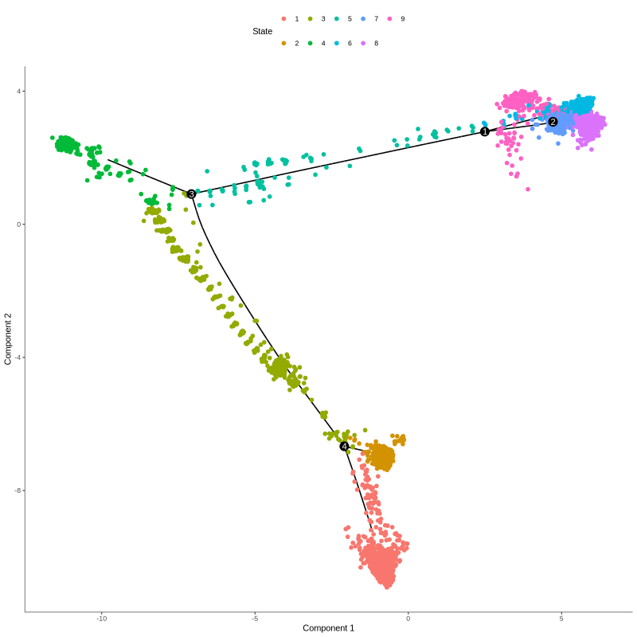
```

### Slingshot

Running Slingshot to infer cell trajectories and lineage relationships involves several steps:

1. Constructs a Slingshot object using PCA embeddings, cell types, start clusters, and end clusters.

2. Computes and plots the trajectory curves.

3. Computes and plots pseudotime values along the trajectory.

####  Function arguments:

* `slingshot.PCAembeddings`: A matrix containing the PCA embeddings of the single-cell data, typically obtained from dimensionality reduction techniques like PCA.
* `slingshot.cellTypes`: A character vector specifying cell types or labels for each cell.
* `slingshot.start.clus`: A character vector specifying the initial cluster(s) from which cell trajectories should start.
* `slingshot.end.clus`: A character vector specifying the target cluster(s) where cell trajectories should end.
* `slingshot.colors`: A vector of colors corresponding to cell types for plotting. If not provided, default colors will be used.

####  codes for running Slingshot
```{R, eval=FALSE}
if( (length(input.data.dirs) > 1) & Step2_Quality_Control.RemoveBatches ){
    DefaultAssay(sc_object.subset) <- 'integrated'
}else{
    DefaultAssay(sc_object.subset) <- 'RNA'}
run_slingshot(slingshot.PCAembeddings = Embeddings(sc_object.subset, reduction = "pca")[, PCs],
              slingshot.cellTypes = sc_object.subset@meta.data$selectLabels,
              slingshot.start.clus = slingshot.start.clus,
              slingshot.end.clus = slingshot.end.clus,
              slingshot.colors = slingshot.colors,
              output.dir = paste0(output.dir, '/Step12.Construct_trajectories/slingshot/'))
```

```{r echo=FALSE,fig.cap="Figures showing slingshot curve and infered pseudotime value", out.width = "400px" , fig.align = 'center', out.width='50%', fig.show='hold'}
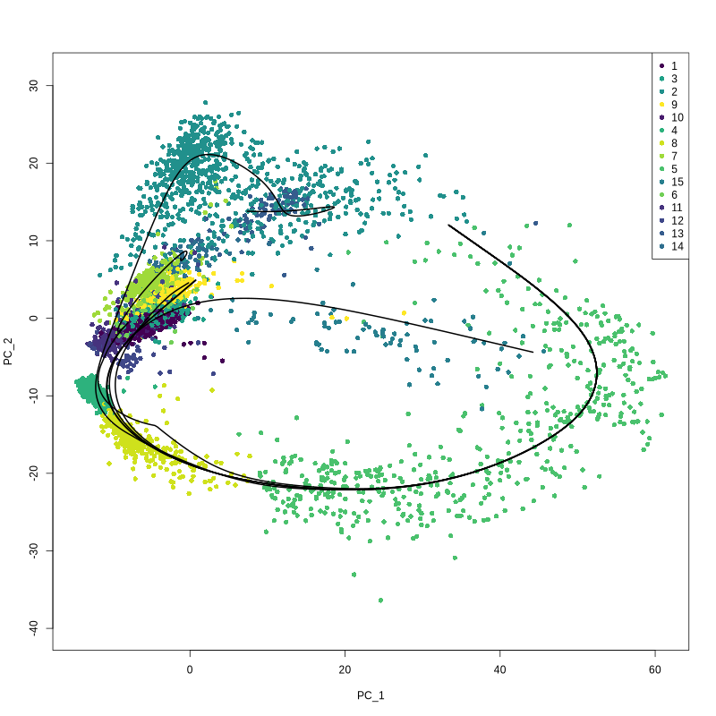
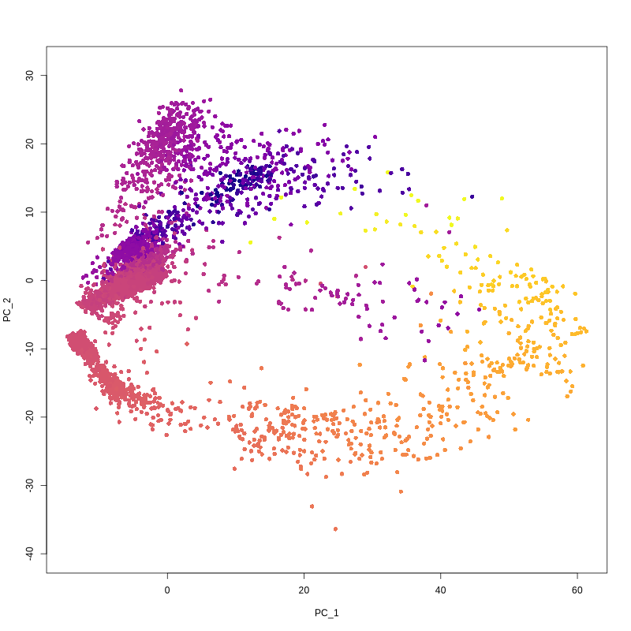
```

### scVelo

scVelo is implemented in Python, and it takes a Seurat object, cell embeddings, and cell type information as input. The process of data preparation includes the following steps:

1. Format the Seurat object metadata, including cell types and sample names.

2. Extract the spliced, unspliced, and ambiguous count matrices from the Seurat object.

3. Combine the metadata and cell embeddings.

4. Write the necessary input files for scVelo analysis, including cell embeddings, count matrices, and metadata.

#### Function arguments:

* `sc_object`: A Seurat object containing the single-cell RNA-seq data.
* `loom.files.path`: A character vector specifying the path(s) to the loom files for scVelo analysis.
* `scvelo.reduction`: A character specifying the reduction method used for scVelo analysis (default is 'pca').
* `scvelo.column`: A character specifying the column in the Seurat object metadata containing cell types.

#### codes for running Scvelo
```{R, eval=FALSE}
if((!is.null(loom.files.path))&(!is.null(pythonPath))){
    prepareDataForScvelo(sc_object = sc_object.subset,
                         loom.files.path = loom.files.path,
                         scvelo.reduction = 'pca',
                         scvelo.column = 'selectLabels',
                         output.dir = paste0(output.dir, '/Step12.Construct_trajectories/scVelo/'))

    reticulate::py_run_string(paste0("import os\noutputDir = '", output.dir, "'"))
    reticulate::py_run_file(file.path(system.file(package = "HemaScopeR"), "python/sc_run_scvelo.py"), convert = FALSE)
}
```
- Save the variables.
```{R, eval=FALSE}
# Get the names of all variables in the current environment
variable_names <- ls()
# Loop through the variable names and save them as RDS files
for (var_name in variable_names) {
  var <- get(var_name)  # Get the variable by its name
  saveRDS(var, file = paste0(output.dir, '/RDSfiles/', var_name, ".rds"))  # Save as RDS with the variable's name
}
```

```{r echo=FALSE,fig.cap="Figure showing trajectory predicted by scvelo", out.width = "400px" , fig.align = 'center'}
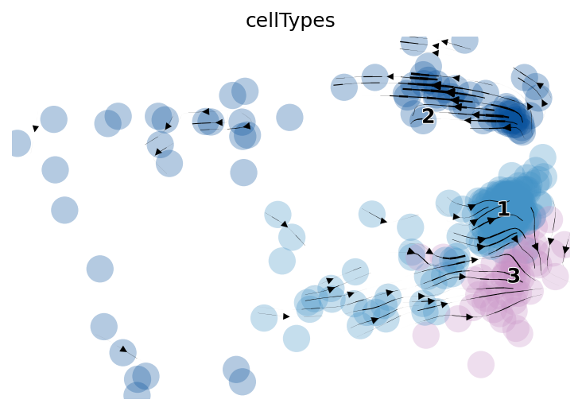 #用的是6.3的结果
```

## Step 13. TF Analysis

This step runs SCENIC (Single-Cell Regulatory Network Inference and Clustering) analysis, including the construction of a co-expression network, gene filtering, correlation, and the GENIE3 algorithm to infer regulatory networks.

### Function arguments:
* `countMatrix`: A matrix containing the raw counts of the single-cell RNA-seq data.
* `cellTypes`: A character vector specifying the cell types or labels for each cell.
* `datasetID`: A character vector specifying the dataset IDs for each cell.
* `cellTypes_colors`: A named vector of colors for cell type visualization.
* `cellTypes_orders`: A character vector specifying the desired order of cell types.
* `groups_colors`: A named vector of colors for grouping visualization.
* `groups_orders`: A character vector specifying the desired order of groups.
* `Org`: A character vector specifying the organism ('mmu' for mouse or 'hsa' for human).

### codes for running step13
- Create folders for saving the results of TF analysis.
```{R, eval=FALSE}
print('Step13. TF analysis.')
if (!file.exists(paste0(output.dir, '/Step13.TF_analysis/'))) {
  dir.create(paste0(output.dir, '/Step13.TF_analysis/'))
}
```
- Run SCENIC to perform TF analysis.
```{R, eval=FALSE}
run_SCENIC(countMatrix = countsSlot,
           cellTypes = sc_object@meta.data$selectLabels,
           datasetID = sc_object@meta.data$datasetID,
           cellTypes_colors = Step13_TF_Analysis.cellTypes_colors,
           cellTypes_orders = unique(sc_object@meta.data$selectLabels),
           groups_colors = Step13_TF_Analysis.groups_colors,
           groups_orders = unique(sc_object@meta.data$datasetID),
           Org = Org,
           output.dir = paste0(output.dir, '/Step13.TF_analysis/'),
           pythonPath = pythonPath,
           databasePath = databasePath)
```
- Save the variables.
```{R, eval=FALSE}
# Get the names of all variables in the current environment
variable_names <- ls()
# Loop through the variable names and save them as RDS files
for (var_name in variable_names) {
  var <- get(var_name)  # Get the variable by its name
  saveRDS(var, file = paste0(output.dir, '/RDSfiles/', var_name, ".rds"))  # Save as RDS with the variable's name
}
```

```{r echo=FALSE,fig.cap="Heatmap showing predicted regulon activity for each cell", out.width = "800px" , fig.align = 'center'}
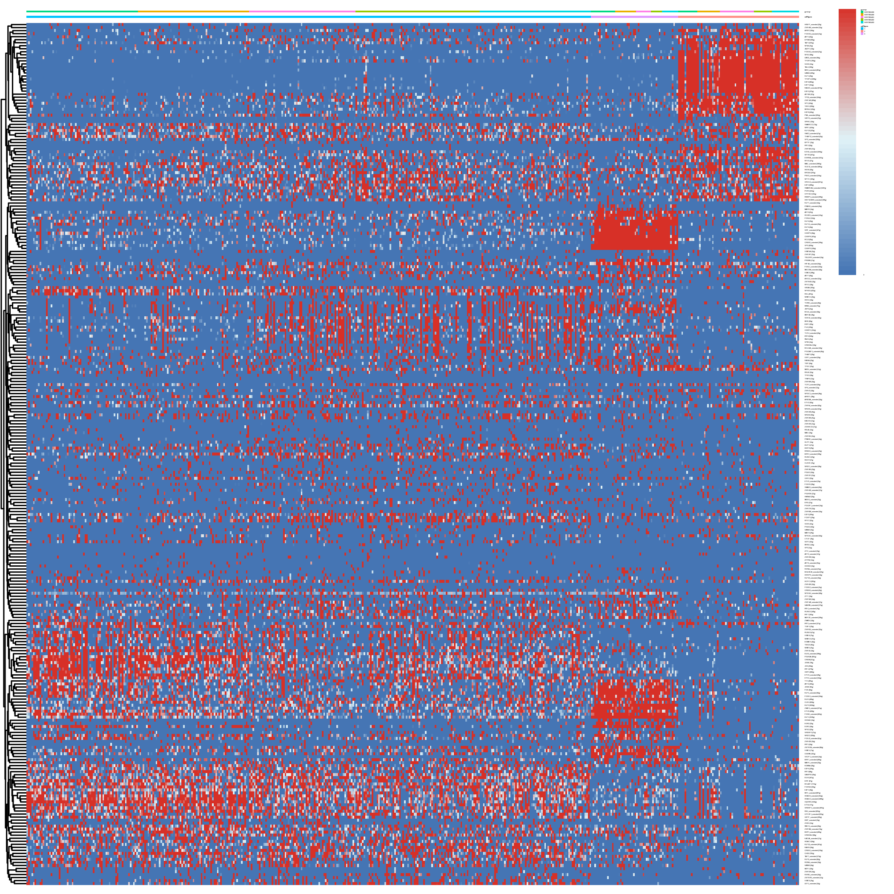
```

```{r echo=FALSE,fig.cap="Heatmap showing statistics of regulons", out.width = "400px" , fig.align = 'center'}
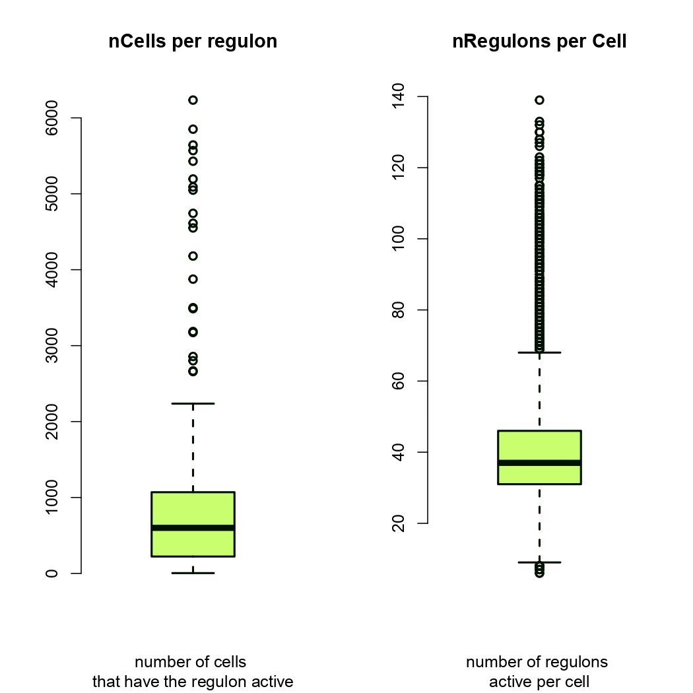
```

## Step 14. Cell-Cell Interaction

The step takes expression data, cluster labels, and other parameters to perform cell-cell communication analysis using the CellChat package. It includes the following steps:

1. Data input and preprocessing.

2. Initialization of a CellChat object.

3. Set the ligand-receptor interaction database based on the specified organism.

4. Preprocess the expression data for cell-cell communication analysis.

5. Identify overexpressed genes and interactions.

6. Project data based on protein-protein interaction networks.

7. Inference of cell-cell communication network.

8. Visualization of the communication network.

9. Systems analysis of cell-cell communication network.

### Function arguments:
* `data.input`: A matrix of expression data, where rows represent genes and columns represent cells. Row names should be in the format of gene symbols.
* `labels`: A vector of cluster labels for each cell, corresponding to the columns of data.input.
* `cell.orders`: A character vector specifying the order of cell types or clusters in the analysis.
* `cell.colors`: A character vector specifying colors for cell types or clusters in the analysis.
* `sample.names`: A vector of sample or cell names, corresponding to the columns of data.input.
* `Org`: A string indicating the organism used in the analysis. It should be either "mmu" (mouse) or "hsa" (human).
* `sorting`: A logical value indicating whether to consider cell population size in communication analysis.

### codes for running step14
- Create folders for saving the results of cell-cell interaction analysis.
```{R, eval=FALSE}
print('Step14. Cell-cell interaction.')
if (!file.exists(paste0(output.dir, '/Step14.Cell_cell_interection/'))) {
  dir.create(paste0(output.dir, '/Step14.Cell_cell_interection/'))
}
```
- Run CellChat to perform cell-cell interaction analysis.
```{R, eval=FALSE}
tempwd <- getwd()
run_CellChat(data.input=countsSlot,
             labels = sc_object@meta.data$selectLabels,
             cell.orders = ViolinPlot.cellTypeOrders,
             cell.colors = ViolinPlot.cellTypeColors,
             sample.names = rownames(sc_object@meta.data),
             Org = Org,
             sorting = sorting,
             output.dir = paste0(output.dir, '/Step14.Cell_cell_interection/'))
setwd(tempwd)
```
- Save the variables.
```{R, eval=FALSE}
# Get the names of all variables in the current environment
variable_names <- ls()
# Loop through the variable names and save them as RDS files
for (var_name in variable_names) {
  var <- get(var_name)  # Get the variable by its name
  saveRDS(var, file = paste0(output.dir, '/RDSfiles/', var_name, ".rds"))  # Save as RDS with the variable's name
}  
```

```{r echo=FALSE,fig.cap="Figures showing the interaction number and strength between each cell group", out.width = "400px" , fig.align = 'center', out.width='50%', fig.show='hold'}
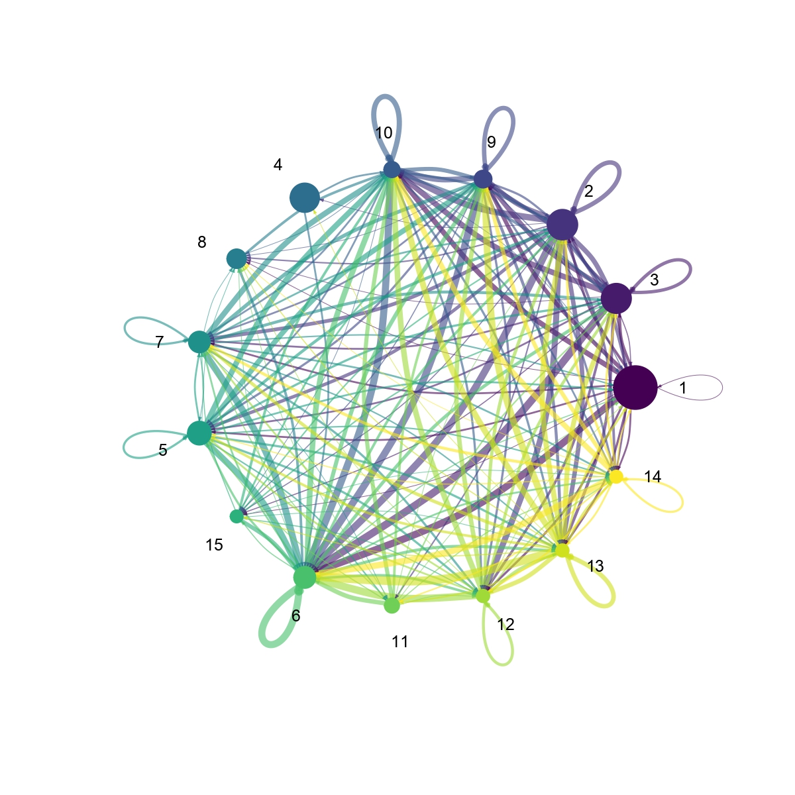
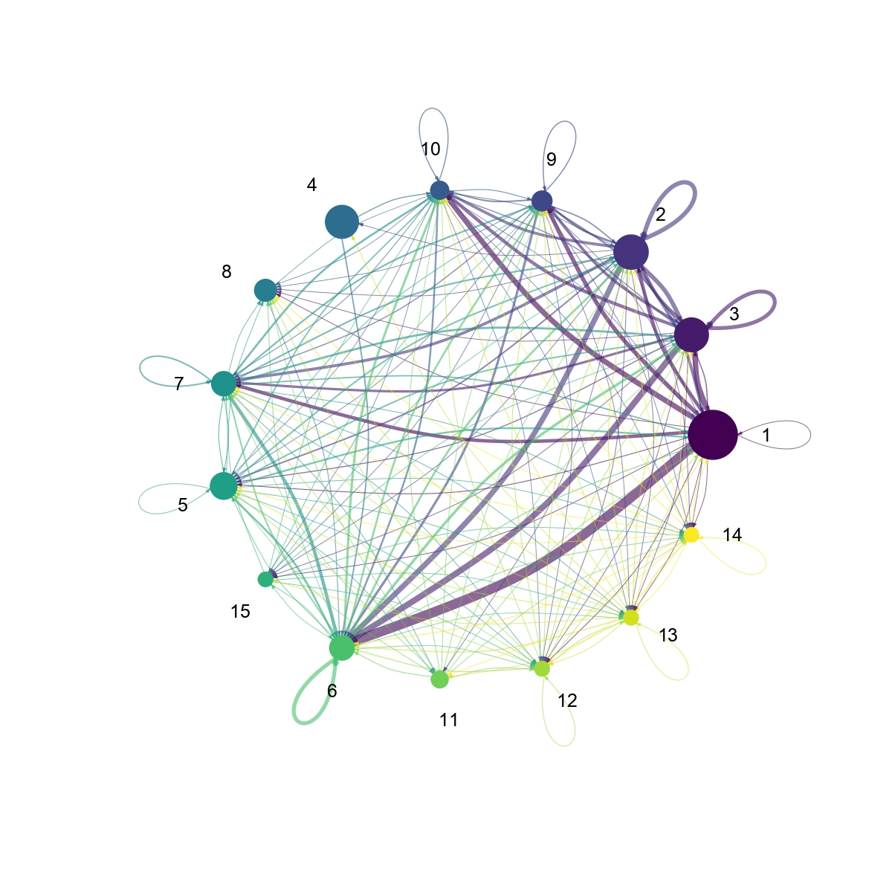
```

```{r echo=FALSE,fig.cap="Heatmap showing the strength of incoming and outgoing signals for each cell type group across various pathways.", out.width = "400px" , fig.align = 'center', out.width='50%', fig.show='hold'}
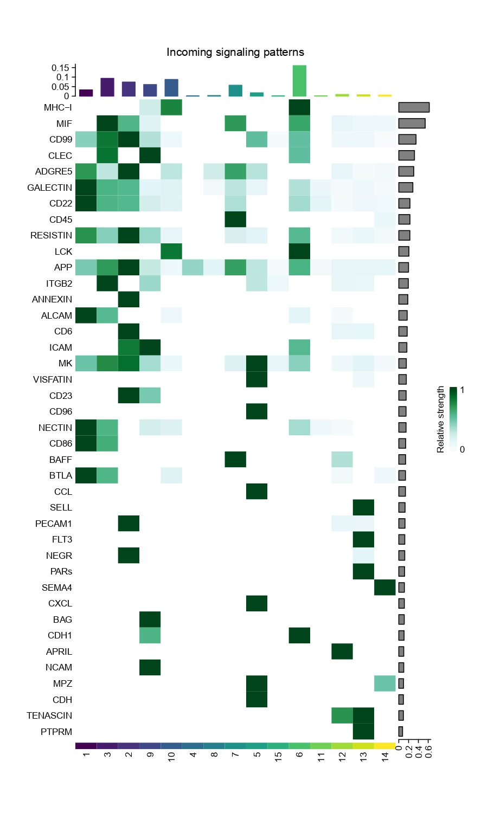
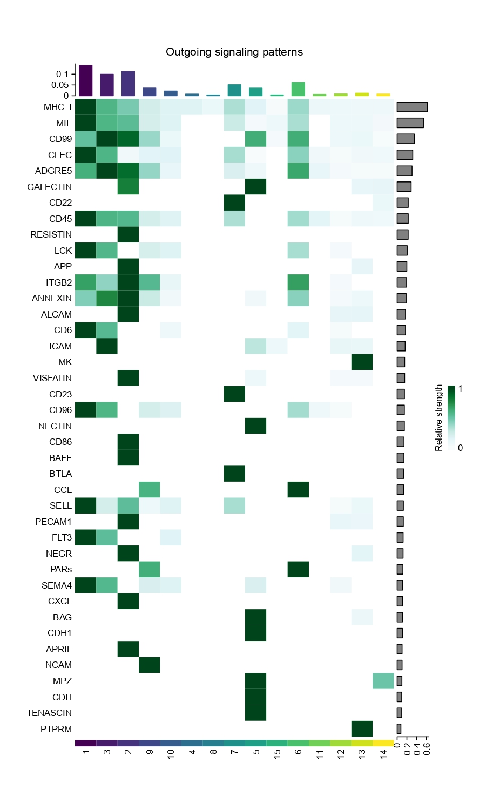
```

```{r echo=FALSE,fig.cap="Figure showing LRs interaction between each cell type group", out.width = "400px" , fig.align = 'center'}
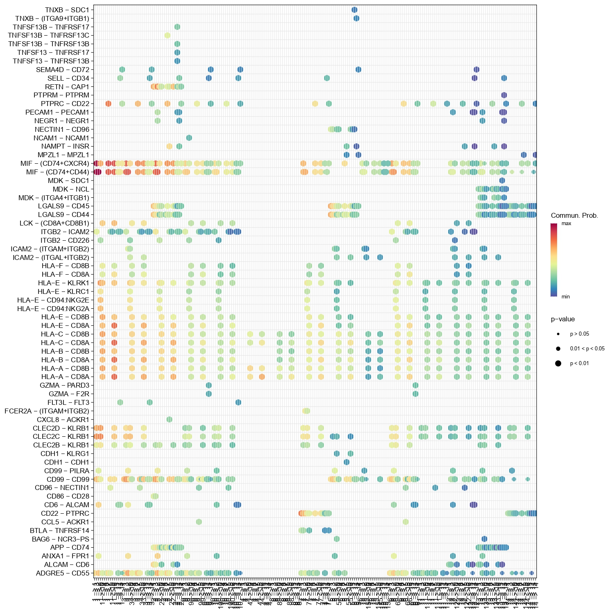
```

