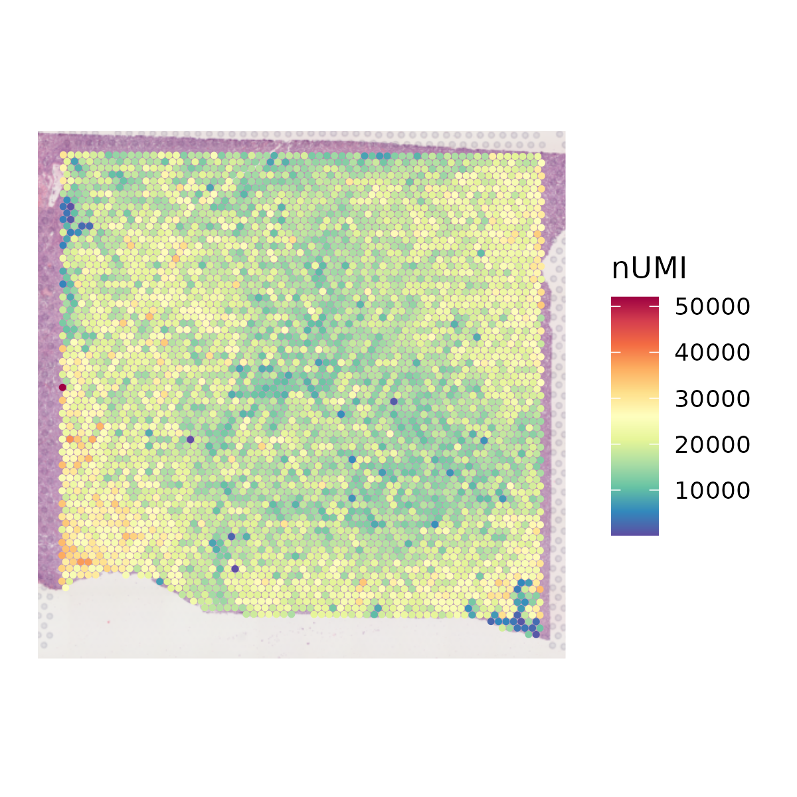
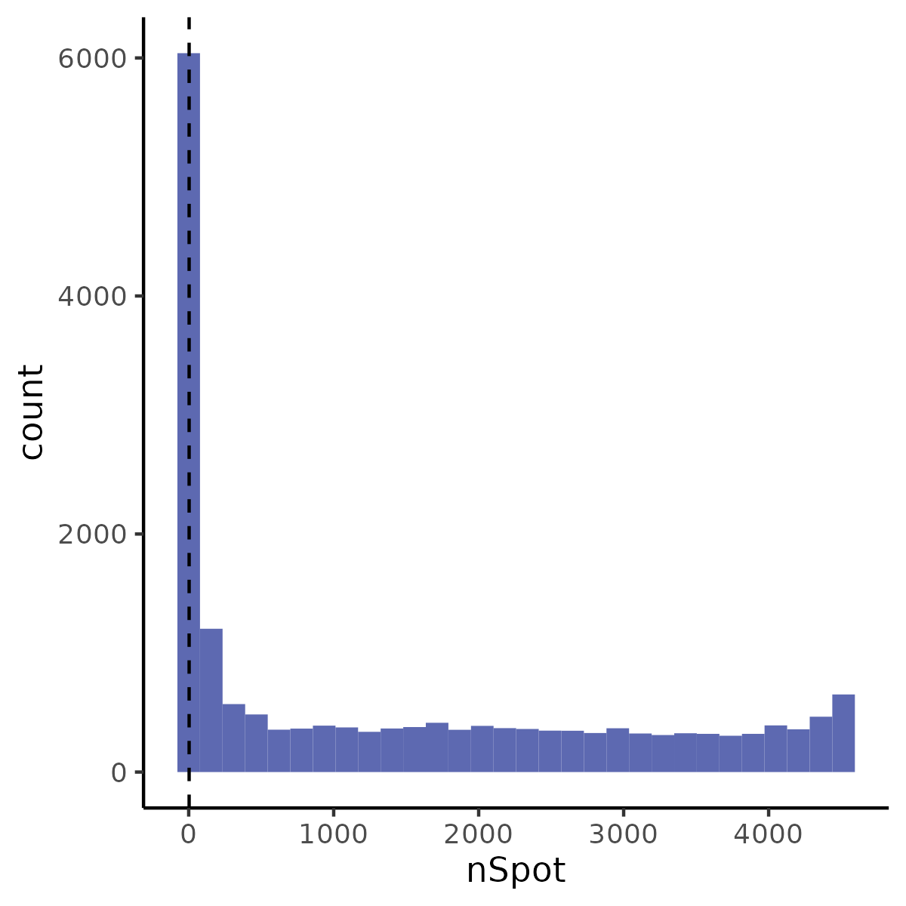
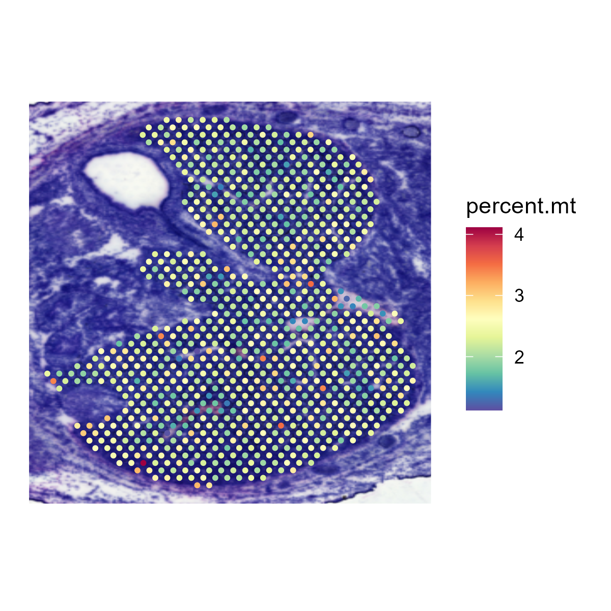
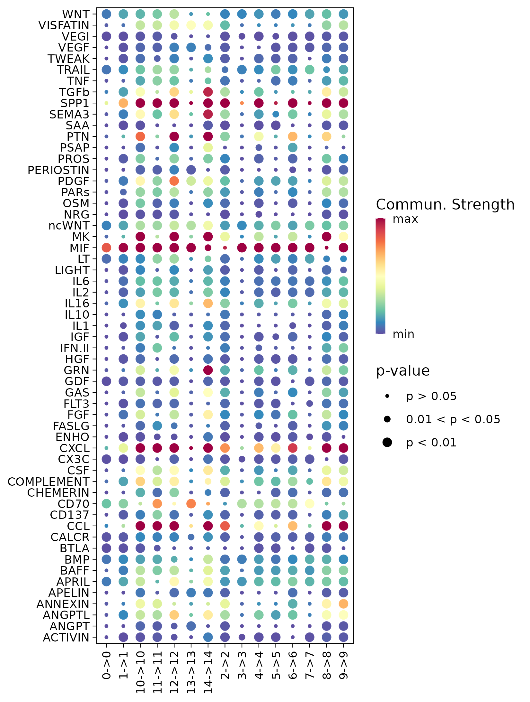
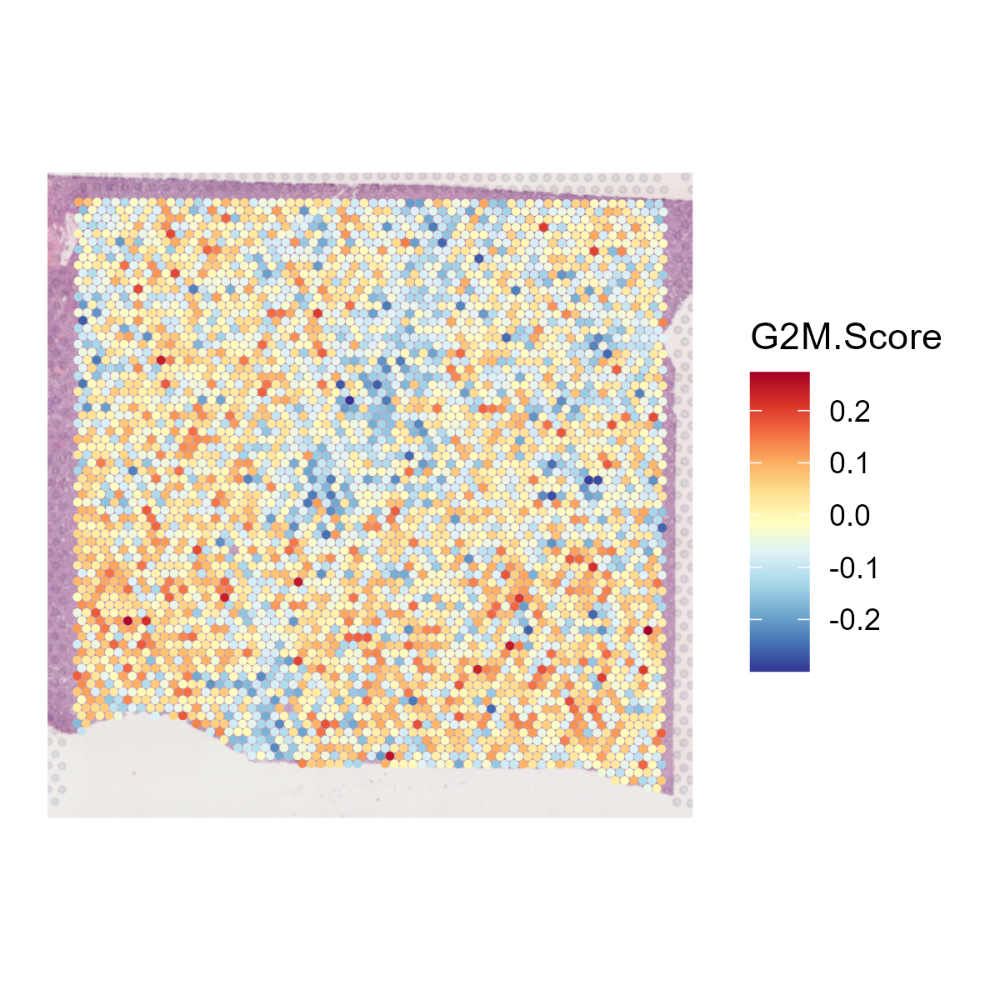
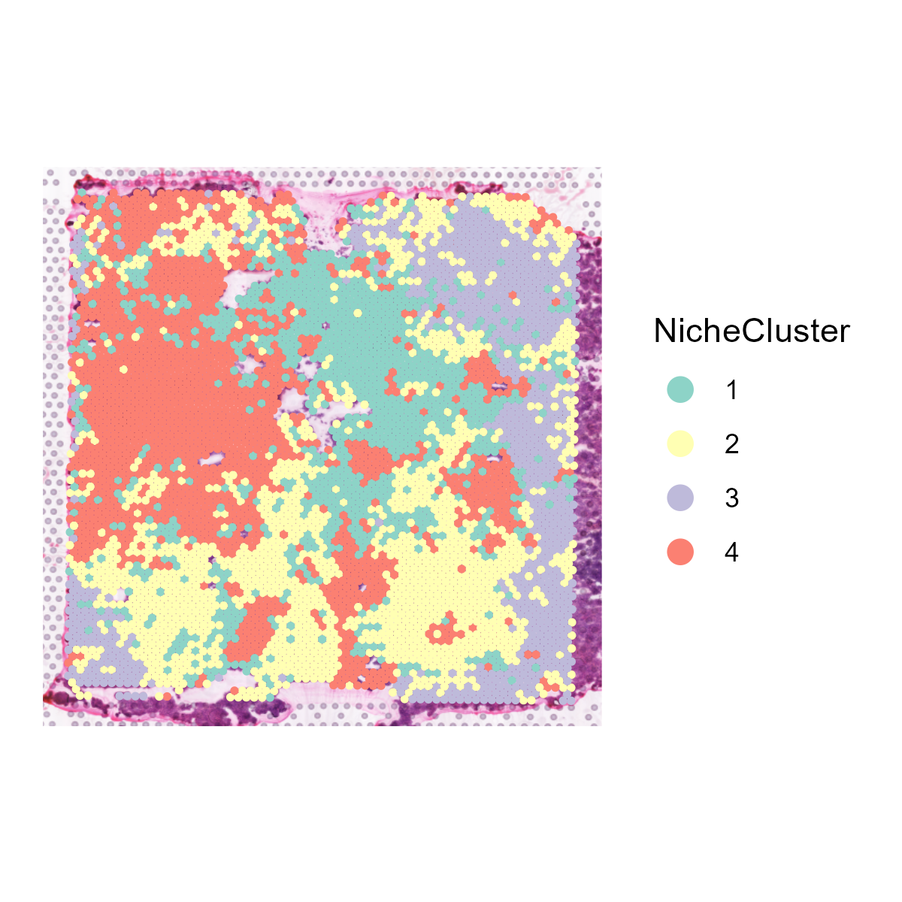

# Stey-by-step st-seq pipeline

## Step 1. Data loading

The `st_Loading_Data` function is designed for loading [10X Visium](https://www.10xgenomics.com/cn/products/spatial-gene-expression) spatial transcriptomics data from [Space Ranger](https://www.10xgenomics.com/cn/support/software/space-ranger/latest). It will load data from `input.data.dir` and output it in the [SeuratOjbect](https://github.com/satijalab/seurat-object) format.

### Function arguments:
* `input.data.dir`: The directory where the input data is stored.
* `output.dir`: The directory where the processed output will be saved. If not specified, the output is saved in the current working directory. Default is '.'.
* `sampleName`: A string naming the sample. Default is 'Hema_ST'.
* `rds.file`: A boolean indicating if the input data is in RDS file format rather than a typical results of Space Ranger. Default is FALSE.
* `filename`: The name of the file to be loaded if the data is not in RDS format. Default is "filtered_feature_bc_matrix.h5".
* `assay`: The specific assay to apply to the data. Default is 'Spatial'.
* `slice`: The image slice identifier for the spatial data. Default is 'slice1'.
* `filter.matrix`: A boolean indicating whether to load filtered matrix. Default is TRUE.
* `to.upper`: A boolean indicating whether to convert feature names to upper form. Default is FALSE.

### Funciton behavior:

1. Directory Creation: The function first checks if the `output.dir` exists; if not, it creates it.
2. RDS File Handling:
If `rds.file` is TRUE, it reads the RDS file, ensuring the specified `assay` and `slice` are present in the Seurat object.
3. Non-RDS File Handling:
If `rds.file` is FALSE, it loads the data using `Load10X_Spatial` from `Seurat`.
4. Saving the Object:
Uses `SaveH5Seurat` and `Convert` to save the Seurat object in rds and h5ad formats.
5. File Copying:
Copies any necessary files (filter matrix, spatial image) to the `output.dir`.
7. Return Value:
Returns the processed Seurat object.

### An example:

```
st_obj <- st_Loading_Data(
        input.data.dir = 'path/to/data',
        output.dir = '.',
        sampleName = 'Hema_ST,
        rds.file = FALSE,
        filename = 'filtered_feature_bc_matrix.h5',
        assay = 'Spatial',
        slice = 'slice1',
        filter.matrix = TRUE,
        to.upper = FALSE
    )
```

### Outputs:

* Spatial transcriptome data in rds and h5ad formats

## Step 2. QC

The `QC_Spatial` function performs basic quality control on a SeuratObject containing 10X visium data and returns the filtered SeuratObject. It provides options to set thresholds for the number of genes, nUMI (unique molecular identifiers), and spots expressing each gene. It also allows for the removal of mitochondrial genes based on species.

### Function arguments:

* `st_obj`: A SeuratObject of 10X visium data.
* `output.dir`: A character string specifying the path to store the results and figures. Default is the current working directory.
* `min.gene`: An integer representing the minimum number of genes detected in a spot. Default is 200.
* `max.gene`: An integer representing the maximum number of genes detected in a spot. Default is Inf (no upper limit).
* `min.nUMI`: An integer representing the minimum number of nUMI detected in a spot. Default is 500.
* `max.nUMI`: An integer representing the maximum number of nUMI detected in a spot. Default is Inf (no upper limit).
* `min.spot`: An integer representing the minimum number of spots expressing each gene. Default is 3.
* `species`: A character string representing the species of sample, either 'human' or 'mouse'.
* `bool.remove.mito`: A boolean value indicating whether to remove mitochondrial genes. Default is TRUE.
* `SpatialColors`: A function that interpolates a set of given colors to create new color palettes and color ramps. Default is a color palette with reversed Spectral colors from `RColorBrewer`.

### Function behavior:

1. Plots and saves the spatial distribution of nUMI and nGene.
2. Plots and saves violin plots for nUMI and nGene.
3. Identifies and marks low-quality spots based on nUMI and nGene thresholds.
4. Plots the spatial distribution of quality.
5. Plots and saves a histogram for the number of spots expressing each gene.
6. Plots the spatial distribution of mitochondrial genes.
7. Saves the raw SeuratObject before filtering.
8. Removes low-quality spots and genes with fewer occurrences.
9. Optionally removes mitochondrial genes.
10. Saves the filtered SeuratObject.
11. Returns the filtered `st_obj`.

### An example:

```
st_obj <- QC_Spatial(
            st_obj = st_obj,
            output.dir = '.',
            min.gene = 200,
            min.nUMI = Inf,
            max.gene = 500,
            max.nUMI = Inf,
            min.spot = 3,
            species = 'human',
            bool.remove.mito = TRUE,
            SpatialColors = colorRampPalette(colors = rev(x = brewer.pal(n = 11, name = "Spectral")))
        )
```

### Outputs:

* Figures showing the spatial distribution of nUMI and nGene.
<center class="half">
    
    
</center>

* Violin plots of nUMI and nGene.
<center class="half">
    
    
</center>

* Figures showing the quality.
<center class="half">
    
</center>

* Histograms for the number of spots expressing each gene.
<center class="half">
    
</center>

* Figures showing the spatial distribution of mitochondrial genes.
<center class="half">
    
</center>

* Raw and filtered SeuratObject.

## Step 3. Clustering

The `st_Clustering` function is designed to perform clustering analysis on spatial transcriptomics data. It integrates several key steps including data normalization, dimensionality reduction, clustering, and visualization. The function saves the results and visualizations to `output.dir`.

### Function arguments:

* `st_obj`: The input spatial transcriptomics seurat object that contains the data to be clustered.
* `output.dir`: The directory where the output files will be saved. Default is the current directory ('.').
* `normalization.method`: The method used for data normalization. Default is 'SCTransform'.
* `npcs`: The number of principal components to use in PCA. Default is 50.
* `pcs.used`: The principal components to use for clustering. Default is the first 10 PCs (1:10).
* `resolution`: The resolution parameter for the clustering algorithm. Default is 0.8.
* `verbose`: A logical flag to print progress messages. Default is FALSE.

### Function behavior:

1. Data Normalization and PCA: Depending on the `normalization.method`, the function either uses `SCTransform` or a standard normalization method followed by scaling and variable feature detection. Performs PCA on the normalized data.
2. Clustering and Dimensionality Reduction: Finds nearest neighbors using the specified principal components (`pcs.used`). Identifies clusters using the specified `resolution`. Performs UMAP and t-SNE for visualization of the clusters.
3. Visualization: Generates spatial, UMAP, and t-SNE plots of the clusters with customized color schemes.
Saves these plots as images in the specified directory.
4. Saving Results: Saves the updated `st_obj` as an RDS file. Exports the metadata of `st_obj` to a CSV file.
5. Return Value: Returns the updated `st_obj` containing the clustering results.

### An example:

```
st_obj <- st_Clustering(
            st_obj = st_obj,
            output.dir = '.',
            normalization.method = 'SCTransform',
            npcs = 50,
            pcs.used = 1:10,
            resolution = 0.8,
            verbose = FALSE
        )
```

### Outputs:

* Figures showing the results of clustering.
<center class="half">
    
    
    
</center>

* SeuratObject in rds format.

## Step 4. DEGs

The `st_Find_DEGs` function is designed to identify differentially expressed genes (DEGs) in spatial transcriptomics data. It performs differential expression analysis based on clustering results, visualizes the top markers, and saves the results to `output.dir`.

### Function arguments:

* `st_obj`: The input spatial transcriptomics object containing the data for DEG analysis.
* `output.dir`: The directory where output files will be saved. Default is the current directory ('.').
* `ident.label`: The metadata label used for identifying clusters. Default is `'seurat_clusters'`.
* `only.pos`: A logical flag to include only positive markers. Default is TRUE.
* `min.pct`: The minimum fraction of cells expressing the gene in either cluster. Default is `0.25`.
* `logfc.threshold:` The log fold change threshold for considering a gene differentially expressed. Default is `0.25`.
* `test.use`: The statistical test to use for differential expression analysis. Default is `'wilcox'`.
* `verbose`: A logical flag to print progress messages. Default is FALSE.

### Function behavior:

1. Set Identifiers: Sets the cluster identifiers in the spatial transcriptomics object (`st_obj`) based on the specified `ident.label`.
2. Find Differentially Expressed Genes (DEGs): Performs differential expression analysis using the specified parameters (`only.pos`, `min.pct`, `logfc.threshold`, `test.use`).
3. Top Marker Genes: Selects the top 5 marker genes for each cluster based on the highest average log fold change.
4. Visualization: Generates a dot plot for the top DEGs and saves the plot as an image in the specified directory.
5. Saving Results: Saves the DEG results as a CSV file.
6. Return Value: Returns the data frame containing the identified DEGs.

### An example:

```
st.markers <- st_Find_DEGs(
            st_obj = st_obj,
            output.dir = '.',
            ident.label = 'seurat_clusters',
            only.pos = TRUE,
            min.pct = 0.25,
            logfc.threshold = 0.25,
            test.use = 'wilcox',
            verbose = FALSE
        )
```

### Outputs:

* Dot plots showing markers.
<center class="half">
    
</center>

* CSV file containing the information of markers.

## Step 5. Spatially variable features

The `st_SpatiallyVariableFeatures` function identifies and visualizes spatially variable features (SVFs) in spatial transcriptomics data. It integrates the identification of spatially variable features using a specified method, saves the results to a directory, and creates visualizations of the top spatially variable features.

### Function arguments:

* `st_obj`: The input spatial transcriptomics object containing the data for analysis.
* `output.dir`: The directory where output files will be saved. Default is the current directory.
* `assay`: The assay to be used for finding spatially variable features. Default is `'SCT'`.
* `selection.method`: The method used for selecting spatially variable features. Default is `'moransi'`.
* `n.top.show`: The number of top spatially variable features to visualize. Default is `10`.
* `n.col`: The number of columns for the visualization grid. Default is `5`.
* `verbose`: A logical flag to print progress messages. Default is `FALSE`.

### Function behavior:

1. Identify Spatially Variable Features: Identifies spatially variable features using the specified method and assay. Suppresses warnings during the process.
2. Save Metadata: Extracts metadata features and saves them as a CSV file in `output.dir`.
3. Visualization: Selects the top `n.top.show` spatially variable features. Generates and saves a spatial feature plot of these features in the specified directory.
4. Return Value: Returns the updated `st_obj` containing the identified spatially variable features.

### An example:

```
st_obj <- st_SpatiallyVariableFeatures(
            st_obj = st_obj,
            output.dir = '.',
            assay = st_obj@active.assay,
            selection.method = 'moransi',
            n.top.show = 10,
            n.col = 5,
            verbose = FALSE
        )
```

### Outputs:

* Figures showing SVFs.
<center class="half">
    
</center>

* CSV file containing the information of SVFs.

## Step 6. Spatial interaction

The `st_Interaction` function is used to identify and visualize interactions between clusters based on spatial transcriptomics data. It utilizes [Commot](https://github.com/zcang/COMMOT) to analyze spatial interactions, identify pathway activities, and assess the strength and significance of interactions.

### Function arguments:

* `st_data_path`: Path to the spatial transcriptomics data.
* `metadata_path`: Path to the metadata associated with the spatial transcriptomics data.
* `library_id`: Identifier for the spatial transcriptomics library. Default is `'Hema_ST'`.
* `label_key`: Key in the metadata to identify cell clusters. Default is `'seurat_clusters'`.
* `save_path`: The directory where output files will be saved. Default is the current directory.
* `species`: The species of the spatial transcriptomics data. Default is `'human'`.
* `signaling_type`: Type of signaling interactions to consider. Default is `'Secreted Signaling'`.
* `database`: Database to be used for the analysis. Default is `'CellChat'`.
* `min_cell_pct`: Minimum percentage of cells to consider for interaction analysis. Default is `0.05`.
* `dis_thr`: Distance threshold for defining interactions. Default is `500`.
* `n_permutations`: Number of permutations for assessing significance. Default is `100`.
* `pythonPath `: The path to the Python environment containing `Commot` to use for the analysis. Default is '.'.

### Function behavior:

1. `Commot` Analysis: Uses `Commot` to perform interaction analysis, identifying interactions within and between clusters.
2. Visualization: Generates visualizations of pathway interactions and interactions between ligand-receptors (LRs) within and between clusters, and saves them in `save_path`.

### An example:

```
st_Interaction(
            st_data_path = 'path/to/data',
            metadata_path = 'path/to/metadata',
            library_id = 'Hema_ST',
            label_key = 'seurat_clusters',
            save_path = '.',
            species = 'human',
            signaling_type = 'Secreted Signaling',
            database = 'CellChat',
            min_cell_pct = 0.05,
            dis_thr = 500,
            n_permutations = 100,
            pythonPath = 'path/to/python'
        )
```

### Outputs:

* Dot plot showing pathway interaction between and within clusters.
<center class="half">
    
</center>
<center class="half">
    
</center>

* Dot plot showing LRs interaction between and within clusters.
<center class="half">
    
</center>
<center class="half">
    
</center>

* The information of each LR and pathway.

## Step 7. CNV analysis

The `st_CNV` function identifies and visualizes copy number variations (CNVs) in spatial transcriptomics data. It uses [CopyKAT](https://github.com/navinlabcode/copykat) to perform the CNV analysis, saves the results, and generates visual representations of CNV states.

### Function arguments:

* `st_obj`: The input spatial transcriptomics object containing the data for analysis.
* `save_path`: The directory where output files will be saved.
* `assay`: The assay to be used for CNV analysis. Default is `'Spatial'`.
* `LOW.DR`: The lower threshold for the dropout rate in CopyKAT. Default is `0.05`.
* `UP.DR`: The upper threshold for the dropout rate in CopyKAT. Default is `0.1`.
* `win.size`: The window size for the CNV analysis. Default is `25`.
* `distance`: The distance metric to be used for the analysis. Default is `"euclidean"`.
* `genome`: The genome version to be used, 'hg20' or 'mm10'. Default is `"hg20"`.
* `n.cores`: The number of cores to be used for parallel processing. Default is `1`.
* `species`: The species of the spatial transcriptomics data. Default is `'human'`.

### Function behavior:

1. CopyKAT Analysis: Runs `CopyKAT` pipeline to perform CNV analysis using the provided parameters.
2. Saving Results: Saves the CopyKAT results as an RDS file.
3. Plotting: Generates plots of the CNV states and saves them in `save_path`.
4. Updating Metadata: Updates the spatial transcriptomics object with CNV state metadata.
5. Return Value: Returns the updated `st_obj` containing the CNV state information.

### An example:

```
st_obj <- st_CNV(
            st_obj = st_obj,
            save_path = '.',
            assay = 'Spatial',
            LOW.DR = 0.05,
            UP.DR = 0.1,
            win.size = 25,
            distance = "euclidean",
            genome = 'hg20',
            n.cores = 1,
            species = 'human'
        )
```

### Outputs:

* Figures showing the predicted CNV states.
<center class="half">
    
</center>

* Figures showing the CNV heatmap.
<center class="half">
    
</center>

* rds files of results of copykat.

## Step 8. Deconvolution

The `st_Deconvolution` function aims to perform spatial deconvolution analysis on spatial transcriptomics data to estimate the cell-type composition and abundance in different regions. The function utilizes [cell2location](https://github.com/BayraktarLab/cell2location) to infer cell-type abundance and spatial distributions, allowing for the visualization and interpretation of spatially resolved cell populations within the tissue.

### Function arguments:

* `st.data.dir`: Path to the spatial transcriptomics data.
* `sc.h5ad.dir`: Path to the single-cell RNA-seq data in h5ad format. Default is `NULL`.
* `library_id`: Identifier for the spatial transcriptomics library. Default is `'Hema_ST'`.
* `st_obj`: Spatial transcriptomics object containing the data for analysis. Default is `NULL`.
* `save_path`: The directory where output files will be saved. Default is `NULL`.
* `sc.labels.key`: Key in the single-cell metadata to identify cell clusters. Default is `'seurat_clusters'`.
* `species`: The species of the spatial transcriptomics data. Default is `'mouse'`.
* `sc.max.epoch`: Maximum number of epochs used for single-cell deconvolution. Default is `1000`.
* `st.max.epoch`: Maximum number of epochs used for spatial deconvolution. Default is `10000`.
* `use.gpu`: Logical value indicating whether to use GPU for computation. Default is `FALSE`.
`use.Dataset`: The dataset to be used for analysis, such as `'HematoMap'` or `'LymphNode'`.
* `pythonPath `: The path to the Python environment containing `cell2location` to use for the analysis. Default is '.'.

### Function behavior:

1. Deconvolution Analysis: Performs the spatial deconvolution analysis using the provided spatial transcriptomics and single-cell RNA-seq data.
2. Post-Analysis Processing: Processes the deconvolution results and visualizes the spatial distribution of inferred cell types within the tissue.
3. Returning Results: If a Seurat object is provided, the updated Seurat object with cell type information is returned.

### An example:

```
st_obj <- st_Deconvolution(
            st.data.dir = 'path/to/data',
            library_id = 'Hema_ST',
            sc.h5ad.dir = NULL,
            st_obj = st_obj,
            save_path = '.',
            sc.labels.key = 'seurat_clusters',
            species = 'human',
            sc.max.epoch = 1000,
            st.max.epoch = 10000,
            use.gpu = FALSE,
            use.Dataset = 'LymphNode',
            pythonPath = 'path/to/python'
        )
```

### Outputs:

* Figures showing the predicted abundance of each cell-type.
<center class="half">
    
</center>

* The parameters of trained cell2location model.

## Step 9. Cell cycle

The `st_Cell_cycle` function is used to assess the cell cycle phase scores in spatial transcriptomics data. It calculates S phase and G2M phase scores based on the expression of designated cell cycle-related genes and visualizes these scores in spatial and dimensionality-reduced plots.

### Function arguments:

* `st_obj`: The input Seurat object containing the data for analysis.
* `save_path`: The directory where the output images will be saved. Default is the current directory.
* `s.features`: A list of genes associated with the S phase. Default is NULL (using genes from [Seurat](https://satijalab.org/seurat/articles/cell_cycle_vignette.html)).
* `g2m.features`: A list of genes associated with the G2M phase. Default is NULL (using genes from [Seurat](https://satijalab.org/seurat/articles/cell_cycle_vignette.html)).
* `species`: The species of the spatial transcriptomics data. Default is `'human'`.
* `FeatureColors.bi`: A color palette for visualization. Default is a two-color ramp palette.

### Function behavior:

1. Gene Feature Assignment: Assigns S phase and G2M phase gene lists based on the specified species or provided input.
2. Cell Cycle Scoring: Calculates the S phase and G2M phase scores in the data.
3. Spatial Visualization: Generates spatial feature plots to visualize the S phase and G2M phase scores using the specified color palette and saves the plots as images.
4. Dimensionality-Reduced Plot Visualization: If UMAP or tSNE dimensionality reduction is available in the `st_obj`, feature plots of the S phase and G2M phase scores are generated in the reduced space and saved as images.
5. Return Value: Returns the updated `st_obj` containing the cell cycle phase scores.

### An example:

```
st_obj <- st_Cell_cycle(
            st_obj = st_obj,
            save_path = '.',
            s.features = NULL,
            g2m.features = NULL,
            species = 'human',
            FeatureColors.bi = colorRampPalette(colors = rev(x = brewer.pal(n = 11, name = 'RdYlBu')))
        )
```

### Outputs:

* Figures showing S scores.
<center class="half">
    
    
    
</center>

* Figures showing S scores.
<center class="half">
    
    
    
</center>

## Step 10. Niche analysis

The `st_NicheAnalysis` function is designed to perform niche analysis on spatial transcriptomics data, enabling the exploration of spatial niches or microenvironments within the tissue. The function encompasses co-occurrence analysis, niche clustering, and niche interaction analysis to uncover the spatial relationships and characteristics of different cell populations or features.

### Function arguments:

* `st_obj`: The input SeuratObject containing the spatial transcriptomics data for analysis.
* `features`: A vector of features representing features (for example, cell types from deconvolution) for niche analysis.
* `save_path`: The directory where the analysis results and visualizations will be saved. Default is the current directory.
* `coexistence.method`: The method for co-occurrence analysis, accepting `'correlation'` or `'Wasserstein'`. Default is `'correlation'`.
* `kmeans.n`: The number of clusters for niche clustering. Default is `4`.
* `st_data_path`: A path containing the 'spatial' file and 'filtered_feature_bc_matrix.h5' file, required for niche interaction visualization.
* `slice`: The slice to be used for analysis. Default is `'slice1'`.
* `species`: The species of the sample data. Default is `'mouse'`.
* `pythonPath `: The path to the Python environment containing `Commot` to use for the analysis. Default is '.'.

### Function behavior:

1. Co-occurrence Score Calculation: Calculates the co-occurrence scores between the specified features using the chosen coexistence method ('correlation' or 'Wasserstein').
2. Niche Clustering: Utilizes k-means clustering to identify distinct spatial niches based on the expression profiles of the selected features and visualizes the clustering results.
3. Niche Interaction Visualization: If the `st_data_path` is provided, performs niche interaction visualization using `Commot`, which is based on the provided spatial transcriptomics data and generates visualizations of niche interactions within the tissue.
4. Return Value: Returns the updated `st_obj` with niche analysis results and visualizations.

### An example:

```
tmp <- read.csv('path/to/cell2loc_res.csv',
                row.names = 1)
features <- colnames(tmp)

if(!all(features %in% names(st_obj@meta.data))){
    common.barcodes <- intersect(colnames(st_obj), rownames(tmp))
    tmp <- tmp[common.barcodes, ]
    st_obj <- st_obj[, common.barcodes]
    st_obj <- AddMetaData(st_obj,
                          metadata = tmp)
}

st_obj <- st_NicheAnalysis(
    st_obj,
    features = features,
    save_path = '.',
    coexistence.method = 'correlation',
    kmeans.n = 4,
    st_data_path = 'path/to/data',
    slice = `slice1`,
    species = 'human',
    condaenv = 'path/to/python'
)
```

### Outputs:

* Figures showing the co-existence results.
<center class="half">
    
</center>

* Figures showing the spatial distribution of each niche.
<center class="half">
    
</center>

* Figures showing the composition of each niche.
<center class="half">
    
</center>

* Figures showing the results of interactions using `Commot`.